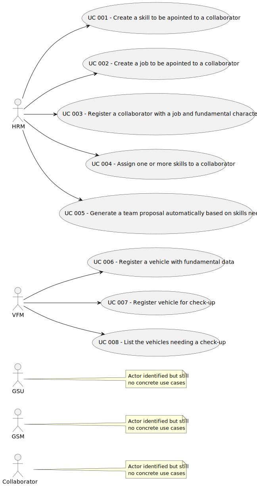

#  User Manual ☆

## 1. Introduction
### 1.1 Purpose and Scope of the application

In an increasingly urbanized world, access to green spaces plays a vital role in enhancing the quality of life for residents. 

Recognizing the significance of green spaces in urban contexts, MusgoSublime (MS) is working to effectively manage these spaces. However, they encounter some obstacles when it comes to efficiently organizing, building, and sustaining urban green spaces.

Therefore, MS has adopted this Software that serves as a comprehensive solution to the innumerable challenges encountered by this organization and others involved in similar endeavors.

This manual is designed to provide you with all the necessary information to effectively utilize the application to manage green spaces for collective use in urban environments. 

Whether you are a Human Resources Manager (HRM), a Vehicle and Equipment Fleet Manager (VFM), a Collaborator, a Green Spaces Manager (GSM) or a Green Spaces User (GSU), this manual will guide you through the features and functionalities of the system.

## 2. System Overview

 ### 2.1 Overall description

Through innovative approaches and meticulous administration, this application delivers a comprehensive software solution for planning, constructing, and maintaining green spaces. 

In order to it, the system integrates various functionalities and tools tailored to the specific needs of the organizations, which are:
*  **Collaborator Management:** Human Resources Managers can efficiently manage the workforce by registering new collaborators, assigning jobs, and managing skills. This functionality enables effective allocation of resources based on expertise and availability.

*  **Team Proposal Generation:** Human Resources Managers can generate team proposals automatically based on predefined criteria such as maximum team size and required skills. This feature streamlines the process of forming teams for specific tasks and projects.

* **Vehicle and Equipment Management:**  Fleet Managers can oversee the organization's fleet of vehicles, machinery, and equipment. This includes registering vehicles, tracking maintenance schedules, and ensuring optimal utilization of resources.

* **Agenda Management:** The system provides a centralized platform for scheduling tasks and activities within green spaces. Users can plan and coordinate various maintenance activities, ensuring timely execution and efficient resource allocation.

* **Green Spaces User Portal:** A user-friendly portal allows Green Spaces Users to interact with the system by posting comments, reporting faults, and providing feedback on the condition of green spaces. This fosters community engagement and enables proactive maintenance and improvement of green areas.

### 2.2 Structure of the application 

The following diagram illustrates an abstract structure of the application and it makes clear the relation between each role and the features.

## 3. System Features

As soon as you open the application, a log-in possibility will be provided so than you can authehticate yourself.

In order to do this, you have to insert your credentials asked: type your e-mail in first and then your password. 
If your access data is correct then  it’s going to appear a list with the options you have attributed to your role.

 ###  **3.1 Human Resource Manager(HRM)**
As an HRM, you're responsible for managing collaborator skills, jobs, and team assignments. Here's how you can accomplish your tasks:

**1. Registering Collaborator Skills:**
* Log in to the system
* Choose the option "Register skills"
* Enter the skill name

**2.  Registering Jobs:**
* Log in to the system
* Choose the option "Register a job"
* Enter the job name

**3. Registering a collaborator with a job and fundamental  characteristics:**
* Log in to the system
* Choose the option "Register a collaborator with a job and fundamental  characteristics"
* Select the desired job for the collaborator from the options given
* Insert the information about the collaborator(name, birthday, admission date, address, cellphone number, e-mail)
* Select the type of IdDocument of the collaborator
* Type the number of the Id of thw collaborator 

**4. Assigning Skills to Collaborators:**

* Log in to the system
* Choose the option "Assign Skills to Collaborators"
* Select the collabborator to assign the skills from the options provided 
* Select the skills from list to add to the collaborator

**5.  Generating Team Proposals:**

* Log in to the system
*  Choose the option "Generate Team Proposals"
* Type the minimum and then the maximum size of the desired team 
* Select the desired skills for the collaborators of the team

###  **3.2 Vehicle and Equipment Fleet Manager (VFM):**

As a VFM, your role involves managing the fleet of vehicles and equipment. Here's what you can do step by step:

**1. Registering Vehicles:**
* Log in to the system
* Choose the option "Register a vehicle"
* Type the Brand, Model, Vehicle Id; Type, \nTare,Gross Weight, Current Km, Register Date, \nAcquisition Date, Maintenance/Checkup Frequency of the vehicle, as requested

**2. Registering Vehicles Check-up:**
* Log in to the system
* Choose the option "Register a vehicle check-up"
* Type the Vehicle ID, Date, Current kms of the vehicle

