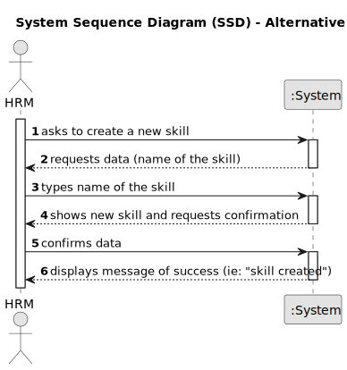
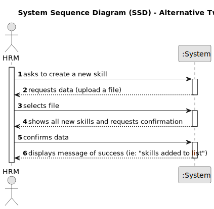

# US001 - Register a skill

## 1. Requirements Engineering

### 1.1. User Story Description

As HRM, I want to register skills that can be apointed to a collaborator.

### 1.2. Customer Specifications and Clarifications 

**From the specifications document:**

>	Each skill enables the collaborator to do a certain job or task and take on responsabilities.

>	The skills will be atributed to a collaborator.

**From the client clarifications:**

> **Question:** What type of information does a skill have?
>
> **Answer:** A skill only has a name, like: driver, prunner...

> **Question:** What criteria are needed to register a skill?
>
> **Answer:** For a skill to be registered the only requirement is the name.

> **Question:** Should the HRM be able to introduce multiple skills in one interaction?
>
> **Answer:** It is not required.

> **Question:** Does the HRM have the option to insert new skill by typing the name of the skill and by uploading a file?
>
> **Answer:** Both ways are accepted but only typing the name of the skill is required.

> **Question:** Does the HRM receive a message of confirmation for the success of the oiperation?
>
> **Answer:** It will depend if you opt for one skill or a set of skills is a batch. In general yes but the message needs to be diferent for each case. 

### 1.3. Acceptance Criteria

* **AC1:** All required fields must be filled in.
* **AC2:** The skill cannot include non-alphanumeric digits such as _" # * ! ? & etc_.
* **AC3:** The skill cannot already exist.

### 1.4. Found out Dependencies

* None

### 1.5 Input and Output Data

**Input Data:**

* Typed data:
    * The name of the skill

OR

* Uploaded File:
    * Multiple lines with multiple names for skills 

**Output Data:**

* (In)Success of the operation

### 1.6. System Sequence Diagram (SSD)

#### Alternative One - Type the name of one skill at a time

#### Alternative Two - Upload file with multiple skill's names

### 1.7 Other Relevant Remarks

*None