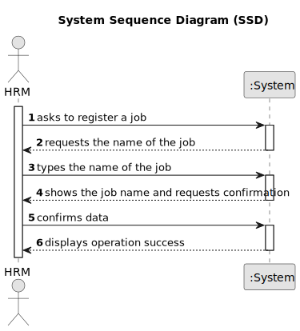

# US002 - Register a job

## 1. Requirements Engineering

### 1.1. User Story Description
As an HRM, I want to register a job that a collaborator needs to have.

### 1.2. Customer Specifications and Clarifications 

**From the specifications document:**  

>	n/a 

**From the client clarifications:**

> **Question:** What data defines a job?
>
> **Answer:** A job is only defined by its name.

> **Question:** What should be shown as output?
>
> **Answer:** The UX/UI is decided by development team.

> **Question:** Can a job have duplicates?
>
> **Answer:** It can't.

### 1.3. Acceptance Criteria

* **AC1:** The "Name" field must be filled.
* **AC2:** A job's name must have at least 3 alphanumeric characters.
* **AC3:** A job's name must be unique.

### 1.4. Found out Dependencies

* n/a

### 1.5 Input and Output Data

**Input Data:**

* Typed data:
    * name
	
* Selected data:
    * n/a 

**Output Data:**

* (In)Success of the operation

### 1.6. System Sequence Diagram (SSD)

### 1.7 Other Relevant Remarks

* n/a