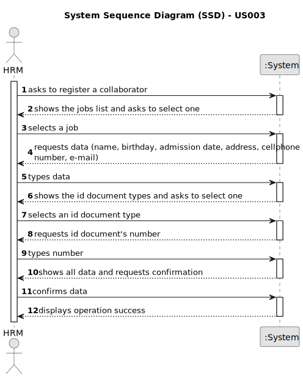

# US003 - Register a collaborator

## 1. Requirements Engineering

### 1.1. User Story Description
As  HRM, I want    to register a collaborator with profession and fundamental attributes.

### 1.2. Customer Specifications and Clarifications 

**From the specifications document:**

>	Each collaborator has a job and a set of skills that enable him to take on certain tasks.

>	The fundamental attributes are: name, birthdate, admission date, address, contact info (mobile and
email), ID doc type and respective number. 

**From the client clarifications:**

> **Question:** Does the user select the job from a list that is displayed?
> 
> **Answer** Displaying the jobs or not is a matter of UX, the development team should decide about it. However, the valid jobs are the ones created within the US02.

> **Question:** What is the format for the numbers from the id document?
> 
> **Answer:** Each document type has specific formats like taxpayer number, citizen Card ou passport.

> **Question:** What should be the accepted format for the emails? Should only specific email services be accepted?
>
> **Answer** A valid email address consists of an email prefix and an email domain, both in acceptable formats.
The prefix appears to the left of the @ symbol. The domain appears to the right of the @ symbol.
For example, in the address example@mail.com, "example" is the email prefix, and "mail.com" is the email domain

### 1.3. Acceptance Criteria

* **AC1:** All required fields must be filled in.
* **AC2:** The cellphone number must have 9 digits.
* **AC3:** A collaborator can only have one job.
* **AC4:** Each document type has its own number format that must be respected.
* **AC5:** The admission date must be typed using the format _dd-mm-yyyy_
* **AC6:** The email must have a prefix(on the left of the @) and a domain(on th right of the @)
* 
### 1.4. Found out Dependencies

* There is a dependency on "US002 - Register a job" as there must be at least a job for a collaborator to be registered.

### 1.5 Input and Output Data

**Input Data:**

* Typed data:
    * name
    * birthday 
    * admission date
    * address
    * cellphone number
    * e-mail
    * ID doc type
    * ID doc number
	

* Selected data:
    * a job

**Output Data:**

* List of existing jobs
* (In)Success of the operation

### 1.6. System Sequence Diagram (SSD)
 
###

### 1.7 Other Relevant Remarks

* None