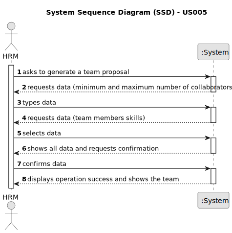

# US005 -  Generate a team proposal

## 1. Requirements Engineering

### 1.1. User Story Description

As HRM, I want to automatically generate a team proposal.

### 1.2. Customer Specifications and Clarifications 

**From the specifications document:**

> Teams are temporary associations of employees who will carry out a set of tasks in
one or more green spaces.

>When creating multipurpose teams, the number of members
and the set of skills that must be covered are crucial.

**From the client clarifications:**

> **Question:** What are the input data to automatically generate a team?
>
> **Answer:** The maximum size of the team (for instance 4)
and the skill needed: 4 tree pruner and 1 light vehicle driver
meaning that one team member have 2 skills.

> **Question:** What should the output of the automation be? (should it just store the team proposal or show it to the customer?)  Will the team proposal be a document about all the instructions of each team member/worker?
>
> **Answer:** The systems provide team proposals and HRM can accept of refuse the proposals.

> **Question:** How does it generate the team if there are not enough employees?
>
> **Answer:** The system should provide information why it can't generate a team.

> **Question:**  Does the HRM need to specify the task first for the team to be generated?
> 
> **Answer:** no

> **Question:**  Should the generated team be assigned the task defined/default into the to-do list?
>
> **Answer:** no

> **Question:**  Can a collaborator be in more than one team at the same time?
>
> **Answer:** no

> **Question:**  I would like to ask if, in this US, there should be any more information in the team generated beyond the collaborators in which it consists?
>
> **Answer:** The information should contain each of team members and its skills.

### 1.3. Acceptance Criteria

* **AC1:** The size of the team must be within the range of the values defined by the HRM.
* **AC2:** The team members must have the skills desired by the HRM.
* **AC3:** If there are not enough employees the system should provide information why it can not generate a team. 
### 1.4. Found out Dependencies

* There is a dependency on "US003 - Register a collaborator" as there must be collaborators to create a team.
* There is also a dependency on "US004 - Assign one or more skills" since a collaborator must have one or more skills.
### 1.5 Input and Output Data

**Input Data:**

* Typed data:
    * minimum number of collaborators
    * maximum number of collaborators
	
* Selected data:
    * skills of collaborators

**Output Data:**

* team proposal (team members and its skills)
* (In)Success of the operation

### 1.6. System Sequence Diagram (SSD)

#### Alternative One

### 1.7 Other Relevant Remarks

* None