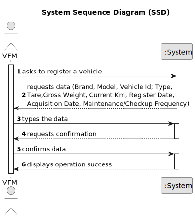

# US006 - Register a vehicle

## 1. Requirements Engineering

### 1.1. User Story Description

As an VFM, I want to register a vehicle.

### 1.2. Customer Specifications and Clarifications 

**From the specifications document:**
>Vehicles are needed to carry out the tasks assigned to the teams as well as to transport
machines and equipment.

> A VFM is responsible for registering vehicles.

**From the client clarifications:**

> **Question:** Should the application identify a registered vehicle by a serial number or other attribute?
>
> **Answer:**
By plate id;

> **Question:**
Should the application a group the vehicles by their brand, serial number or other attribute?
>
> **Answer:** No requirements were set concerning groups of vehicles;

> **Question:**
If the Fm inserts the same vehicle by mistake, should it inform their user of the mistake and give him the option to add another vehicle?
>
> **Answer:** Duplication of data is not a business rule is technical one, since by definition in a set you cant have duplicates.

> **Question:**
When a vehicle is registered, are there specific requirements for accepting the brand? For example, does the system need to check if the brand is on a predetermined list? Does this also apply to the model or any other characteristics?
>
> **Answer:** no; one can consider a list os brands and a list of models previously inserted in the system, no need to go through validations.

> **Question:**
Can a fm register no vehicles or does he have to register at least one?
> 
> **Answer:** The VFM is a role or system user profile that has the rights to perform some system actions (like the ones described by the US06, US07 and US08).
In theory If there is no need to register a vehicle, no vehicles will be registered but that would be rather odd.

### 1.3. Acceptance Criteria

* **AC1:** A vehicle ID must be unique
* **AC2:** Duplicate vehicles can´t be registered.
* **AC3:** The vehicle ID must follow the requested format (After 2020: AA-00-AA between 2005-2020 00-AA-00 between 1992-2005 00-00-XX).
* **AC4:**  All required fields must be filled in.

### 1.4. Found out Dependencies

* None. However, US007 will have a dependency on this user story, as a vehicle check-up needs to have its vehicle registered

### 1.5 Input and Output Data

**Input Data:**

* Typed data:
    * brand
    * model 
    * vehicle ID
    * type
    * tare
    * grossWeight
    * currentKm
    * registerData
    * acquisitionDate 
     * checkupFrequency

**Output Data:**

* (In)Success of the operation

#### Alternative One

### 1.7 Other Relevant Remarks

* None