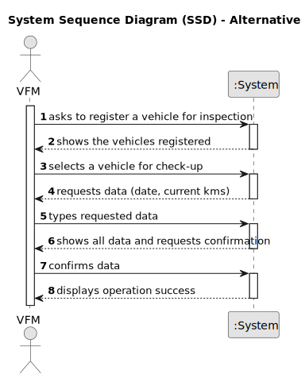

# US007 -  Register Vehicle's Check-Up.

## 1. Requirements Engineering

### 1.1. User Story Description

As a VFM, I intend to register a vehicle for inspection.

### 1.2. Customer Specifications and Clarifications 

**From the specifications document:**

>	Each vehicle is characterized by having a unique vehicle ID.

>	Each vehicle has a check-up which needs the vehicle ID, the date and the current kms.

**From the client clarifications:**

> **Question:**
What information is needed when registering a vehicle for check up?
>
> **Answer:**
Vehicle ID,
Date,
current kms

> **Question:**
What is the unit of measurement used to estimate the check-up frequency (Kms, months, etc.)?
>
> **Answer:**
In real context all could be considered, in the scope of this project just kms will be considered.

> **Question:**
What are the validation requirements for the vehicle ID?
>
> **Answer:**
After 2020: AA-00-AA
between 2005-2020 00-AA-00
between 1992-2005 00-00-XX

> **Question:**
Can a vehicle have more than one check-up?
>
> **Answer:**
yes

> **Question:**
Does a vehicle need to be registered in US06 before being able to go for a check up in US07?
> 
> **Answer:**
yes

> **Question:**
After registering a job/vehicle's checkup should a message (sucess or failure) or a resume of the register appear?
>
> **Answer:**
the UX/UI is up to dev teams.

### 1.3. Acceptance Criteria 

* **AC1:** All required fields must be filled in.
* **AC2:** The vehicle ID must follow the requested format (After 2020: AA-00-AA between 2005-2020 00-AA-00 between 1992-2005 00-00-XX).
* **AC3:** The date must be typed using the format dd-mm-yyyy.
### 1.4. Found out Dependencies

* There is a dependency on "US006 - Register a vehicle" as a vheicle check-up needs an existing vehicle and some info like the current km, provided in US006.

### 1.5 Input and Output Data

**Input Data:**

* Typed data:
    * vehicle ID
    * date
    * current kms
	

**Output Data:**

* (In)Success of the operation

### 1.6. System Sequence Diagram (SSD)

#### Alternative One

