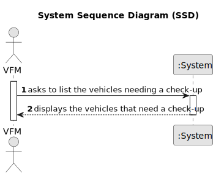

# US008 - List the vehicles needing the check-up

## 1. Requirements Engineering

### 1.1. User Story Description

As an FM, I want to list the vehicles needing the check-up 

### 1.2. Customer Specifications and Clarifications 

**From the specifications document:**

>	Each task is characterized by having a unique reference per organization, a designation, an informal and a technical description, an estimated duration and cost, as well as a task category. 

>	As long as it is not published, access to the task is exclusive to the employees of the respective organization. 

**From the client clarifications:**

> **Question:** What is needed for a vehicle to be considered as needing a check-up?
>
> **Answer:** A vehicle appears on the list if it's current kms exceed or there is a difference of less than 5% of the check-up frequency between the kms the vehicle had in the last check-up plus the check-up frequency.

> **Question:** What data should be displayed for each vehicle in the list?
>
> **Answer:** The list must clearly identify the vehicles through: plate number, brand, model and the reason that justified the checkup need.

### 1.3. Acceptance Criteria

* **n/a**

### 1.4. Found out Dependencies

* There is a dependency on "US006-Register a vehicle" as there must be at least one vehicle to list.

### 1.5 Input and Output Data

**Input Data:**

* n\a

**Output Data:**

* List of vehicles that need the check-up.

### 1.6. System Sequence Diagram (SSD)

### 1.7 Other Relevant Remarks

* If a check-up has never been registered for a vehicle its kms at last check-up are 0. 