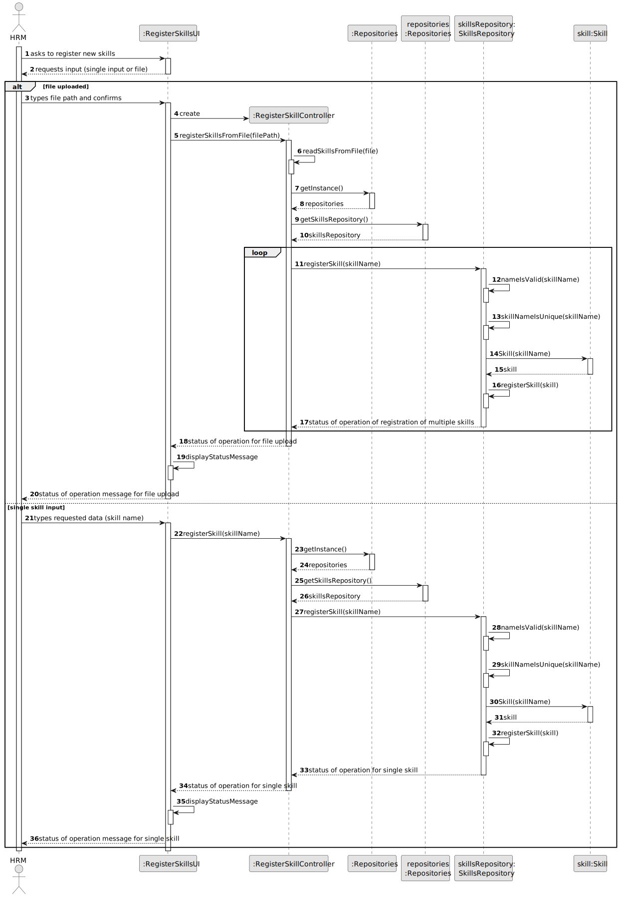
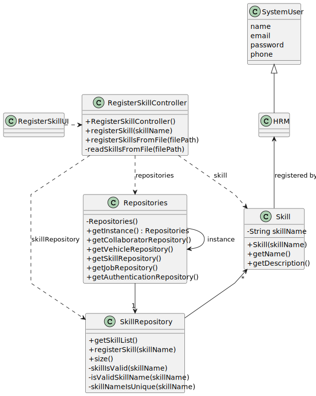

# US006 - Create a Task 

## 3. Design - User Story Realization 

### 3.1. Rationale

_**Note that SSD - Alternative One is adopted.**_

| Interaction ID                                                 | Question: Which class is responsible for...  | Answer                  | Justification (with patterns)                                                                                        |
|:---------------------------------------------------------------|:---------------------------------------------|:------------------------|:---------------------------------------------------------------------------------------------------------------------|
| Step 1 (Asks to create a new skill.)  		                       | 	... interacting with the actor?             | RegisterSkillUI         | Pure Fabrication: there is no reason to assign this responsibility to any existing class in the Domain Model.        |
| 			  		                                                        | 	... coordinating the US?                    | RegisterSkillController | Controller                                                                                                           |
| 			  		                                                        | 							                                      | Employee                | IE: knows its own data (e.g. email)                                                                                  |
| Step 2 (Requests data (name of the skill or file path)) 		     | 	...displying the form for input data?						 | RegisterSkillUI         | IE: is responsible for user interaction.                                                                             |
| Step 3 (Types name of skill or file path) 		                   | 	...instanciating a new skill?               | SkilRepository          | Pure Fabrication: the SkillRepositoryis the only class that follows the rules to be a creator class (contains Skill) |
|                                                                | ... validate the data locally?               | SkillRepository         | IE: registers the skill, passes the verified name                                                                    |
|                                                                | ... validate the data globally?              | SkillRepository         | IE: knows all the skills                                                                                             |
|                                                                | ...saving inputed data?                      | Skill                   | IE: the created object has its own data.                                                                             |
|                                                                | ...saving created skill?                     | SkillRepository         | IE: has all the skills registered                                                                                    |
| Step 4 (Displays status of operation ()success or insuccess)		 | 	...informing operation success?             | RegisterSkillUI         | IE: Responsible for user interaction.                                                                                |

### Systematization ##

According to the taken rationale, the conceptual classes promoted to software classes are: 

* Skill

Other software classes (i.e. Pure Fabrication) identified: 

* RegisterSkillUI  
* RegisterSkillController
* SkillRepository

## 3.2. Sequence Diagram (SD)

_**Note that SSD - Alternative Two is adopted.**_

### Full Diagram

This diagram shows the full sequence of interactions between the classes involved in the realization of this user story.

## 3.3. Class Diagram (CD)

