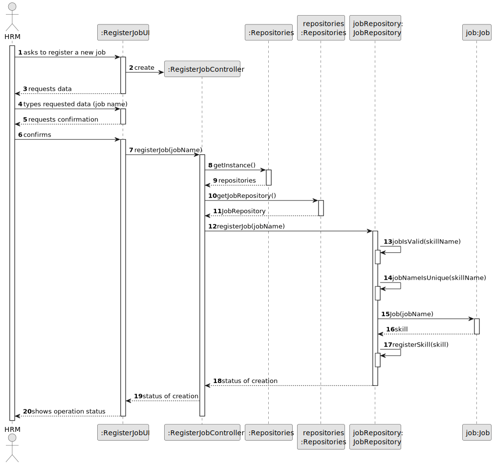
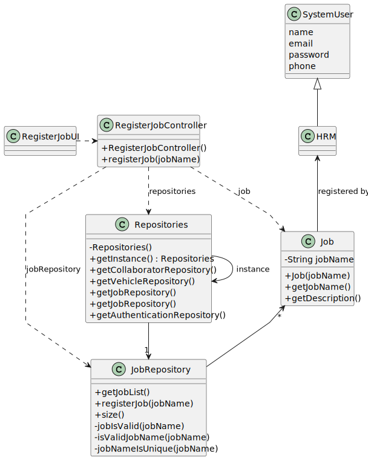

# US002 - Register a job 

## 3. Design - User Story Realization 

### 3.1. Rationale

_**Note that SSD - Alternative One is adopted.**_

| Interaction ID                                   | Question: Which class is responsible for...           | Answer                | Justification (with patterns)                                                                                 |
|:-------------------------------------------------|:------------------------------------------------------|:----------------------|:--------------------------------------------------------------------------------------------------------------|
| Step 1: asks to create a new job                 | ... interacting with the actor?                       | RegisterJobUI         | Pure Fabrication: there is no reason to assign this responsibility to any existing class in the Domain Model. |
|                                                  | ... coordinating the US?                              | RegisterJobController | Controller                                                                                                    |
| Step 2: requests data (i.e. job name)            | ... displaying the form for the actor to input data?  | RegisterJobUI         | IE: is responsible for user interactions.                                                                     |
| Step 3: types requested datatypes requested data | ... temporarily keeping the inputted data?            | RegisterJobUI         | IE: is responsible for temporarily keeping inputted data until user confirmation.                             |
|                                                  | ... instantiating a new job?                          | JobRepository         | Pure Fabrication: there is no class in the Domain Model that follows the rules to be a Creator class.         |
|                                                  | ... saving the inputted data?                         | Job                   | IE: the created object has its own data.                                                                      |
|                                                  | ... validating the data locally (mandatory criteria)? | Job                   | IE: owns its data.                                                                                            |
|                                                  | ... validating the data globally (duplicate data)?    | JobRepository         | IE: knows all of its skills.                                                                                  |
|                                                  | ... saving the created job?                           | JobRepository         | IE: owns all of its skills.                                                                                   |
| Step 4: displays operation success               | ... informing operation success?                      | RegisterJobUI         | IE: is responsible for user interactions.                                                                     |

### Systematization ##

According to the taken rationale, the conceptual classes promoted to software classes are: 

* Job

Other software classes (i.e. Pure Fabrication) identified: 

* RegisterJobUI  
* RegisterJobController
* JobRepository

## 3.2. Sequence Diagram (SD)

### Full Diagram

This diagram shows the full sequence of interactions between the classes involved in the realization of this user story.

## 3.3. Class Diagram (CD)

