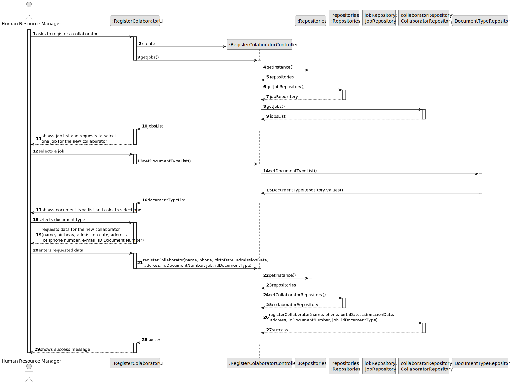
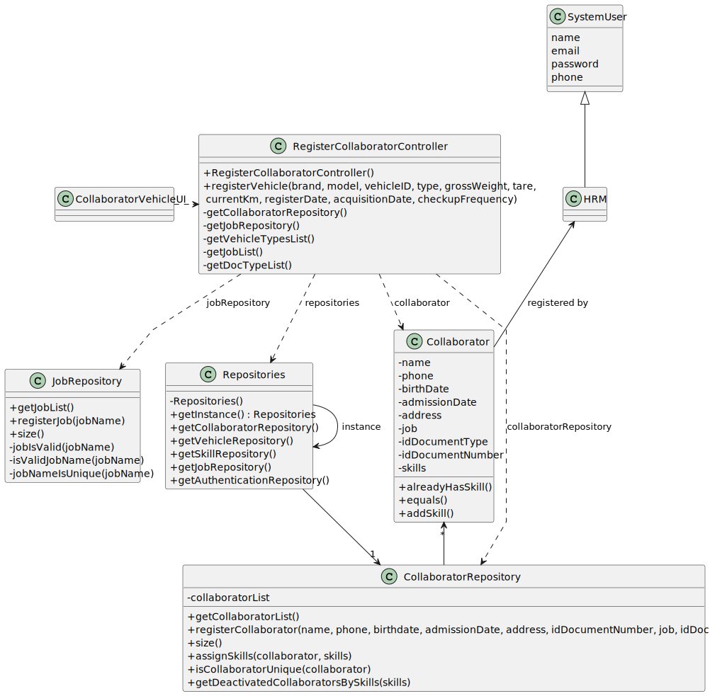

# US003 - Register a collaborator

## 3. Design - User Story Realization

### 3.1. Rationale

_**Note that SSD - Alternative One is adopted.**_

| Interaction ID                                                                                                                        | Question: Which class is responsible for...            | Answer                         | Justification (with patterns)                                                                                             |
|:--------------------------------------------------------------------------------------------------------------------------------------|:-------------------------------------------------------|:-------------------------------|:--------------------------------------------------------------------------------------------------------------------------|
| Step 1 (Asks to register a new collaborator)  		                                                                                      | 	... interacting with the actor?                       | RegisterCollaboratorUI         | Pure Fabrication: there is no reason to assign this responsibility to any existing class in the Domain Model.             |
| 			  		                                                                                                                               | 	... coordinating the US?                              | RegisterCollaboratorController | Controller                                                                                                                |
| Step 2 (Shows jobs list and asks to select one) 		                                                                                    | 	...getting the job list?						                        | JobRepository                  | IE: has the data                                                                                                          |
| 		                                                                                                                                    | 	...displaying the list and form for input data?						 | RegisterCollaboratorUI         | Pure Fabrication                                                                                                          |
| Step 3 (Selects job) 		                                                                                                               | 	...storing the selected data temporarily?             | RegisterCollaboratorUI         | Pure Fabrication                                                                                                          | |                                                                                       |
| Step 2 (Shows document types and asks to select one) 		                                                                               | 	...getting the document type list?						              | DocumentTypeRepository         | IE: has the data                                                                                                          |
| 		                                                                                                                                    | 	...displaying the list and form for input data?						 | RegisterCollaboratorUI         | Pure Fabrication                                                                                                          |
| Step 3 (Selects document type) 		                                                                                                     | 	...storing the selected data temporarily?             | RegisterCollaboratorUI         | Pure Fabrication                                                                                                          | |  
| Step 4 (requests data (id document's number, name, birth date, admission date, address, cellphone number, e-mail, taxpayer number))		 | 	...displaying the form for input data?						          | RegisterCollaboratorUI         | Pure Fabrication                                                                                                          |
| Step 5 (Types data)                                                                                                                   | 	...validating data locally?                           | RegisterCollaboratorUI         | IE: knows the inputted data                                                                                               |
| 		                                                                                                                                    | 	...instantiating a new collaborator?                  | VehicleRepository              | Pure Fabrication: the VehicleRepository is the only class that follows the rules to be a creator class (contains Vehicle) |
|                                                                                                                                       | ...saving inputted data?                               | Vehicle                        | IE: the created object has its own data.                                                                                  |
|                                                                                                                                       | ...validate the data globally?                         | VehicleRepository              | IE: knows all the vehicles                                                                                                |
|                                                                                                                                       | ...registering the collaborator?                       | VehicleRepository              | IE: contains all the registered collaborators                                                                             |
| Step 6 (Displays status of operation)		                                                                                               | 	...informing operation success?                       | VehicleCollaboratorUI          | Pure Fabrication                                                                                                          |

### Systematization ##

According to the taken rationale, the conceptual classes promoted to software classes are:

* Collaborator
* Job

Other software classes (i.e. Pure Fabrication) identified:

* RegisterCollaboratorUI
* RegisterCollaboratorController
* CollaboratorRepository
* JobRepository
* DocumentTypeRepository

## 3.2. Sequence Diagram (SD)

### Full Diagram

This diagram shows the full sequence of interactions between the classes involved in the realization of this user story.

## 3.3. Class Diagram (CD)

