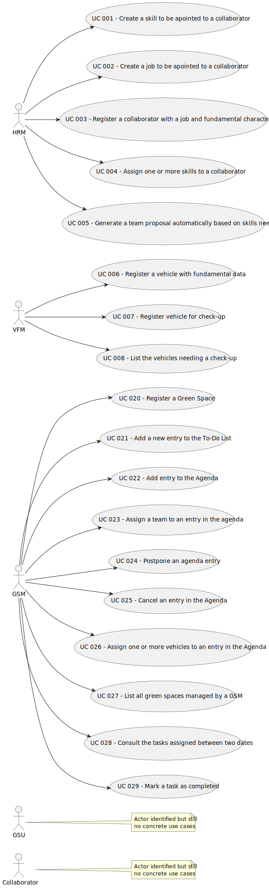

# Use Case Diagram (UCD)

# Use Cases / User Stories

| UC/US | Description                                                                    |                   
|:------|:-------------------------------------------------------------------------------|
| US001 | [Register Skills](../../us001/Readme.md)                                       |
| US002 | [Register a Job](../../us002/Readme.md)                                        |
| US006 | [Register a Collaborator](../../us003/Readme.md)                               |
| US004 | [Assign one or more Skills](../../us004/Readme.md)                             |
| US005 | [Generate Team Proposal](../../us005/Readme.md)                                |
| US006 | [Register a Vehicle](../../us006/Readme.md)                                    |
| US007 | [Register Vehicle Check-up](../../us007/Readme.md)                             |
| US008 | [List Vehicles for Check-up](../../us008/Readme.md)                            |
| US020 | [Register a Green Space](../../us020/Readme.md)                                |
| US021 | [Add a new entry to the To-Do List](../../us021/Readme.md)                     |
| US022 | [Add entry to the Agenda](../../us022/Readme.md)                               |
| US023 | [Assign a team to an entry in the agenda](../../us023/Readme.md)               |
| US024 | [Postpone an agenda entry](../../us024/Readme.md)                              |
| US025 | [Cancel an entry in the Agenda](../../us025/Readme.md)                         |
| US026 | [Assign one or more vehicles to an entry in the Agenda](../../us026/Readme.md) |
| US027 | [List all green spaces managed by a GSM](../../us027/Readme.md)                |
| US028 | [Consult the tasks assigned between two dates](../../us028/Readme.md)          |
| US029 | [Mark a task as completed](../../us029/Readme.md)                              |

