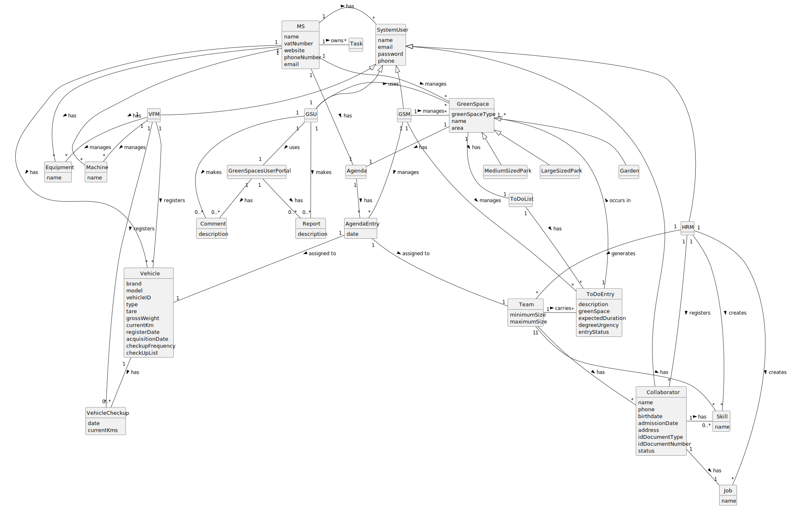

# OO Analysis

The construction process of the domain model is based on the client specifications, especially the nouns (for _concepts_) and verbs (for _relations_) used.

## Rationale to identify domain conceptual classes
To identify domain conceptual classes, start by making a list of candidate conceptual classes inspired by the list of categories suggested in the book "Applying UML and Patterns: An Introduction to Object-Oriented Analysis and Design and Iterative Development".

### _Conceptual Class Category List_

**Business Transactions**

* n/a

---

**Transaction Line Items**

* n/a

---

**Product/Service related to a Transaction or Transaction Line Item**

* n/a

---

**Transaction Records**

* n/a

---  

**Roles of People or Organizations**

* Role: HRM
* Role: VFM
* Role: Collaborator
* Role: GSM
* Role: GSU

---

**Places**

* Garden
* Medium-sized park
* Large-sized park

---

**Noteworthy Events**

* n/a

---

**Physical Objects**

* Vehicles
* Machines
* Equipment

---

**Descriptions of Things**

* n/a

---

**Catalogs**

* n/a

---

**Containers**

* n/a

---

**Elements of Containers**

* n/a

---

**Organizations**

* MS

---

**Other External/Collaborating Systems**

* n/a

---

**Records of finance, work, contracts, legal matters**

* To-do-List 
* Agenda

---

**Financial Instruments**

* n/a

---

**Documents mentioned/used to perform some work/**

* n/a

---

## Rationale to identify associations between conceptual classes

An association is a relationship between instances of objects that indicates a relevant connection and that is worth of remembering, or it is derivable from the List of Common Associations:

- **_A_** is physically or logically part of **_B_**
- **_A_** is physically or logically contained in/on **_B_**
- **_A_** is a description for **_B_**
- **_A_** known/logged/recorded/reported/captured in **_B_**
- **_A_** uses or manages or owns **_B_**
- **_A_** is related with a transaction (item) of **_B_**
- etc.

| Concept (A) 		 | Association   	  |    Concept (B) |
|----------------|:----------------:|---------------:|
| HRM            |  inherits from   |     SystemUser |
| HRM            |     creates      |          Skill |
| HRM            |     creates      |            Job |
| HRM            |     creates      |   Collaborator |
| HRM            |     requests     |   TeamProposal |
| VFM            |  inherits from   |     SystemUser |
| VFM            |    registers     |        Vehicle |
| VFM            |    registers     | VehicleCheckUp |
| VFM            |     manages      |        Machine |
| VFM            |     manages      |      Equipment |
| Collaborator   |  inherits from   |     SystemUser |
| Collaborator   |       has        |            Job |
| Skill          | is atributed to  |   Collaborator |
| Agenda         |       has        |    AgendaEntry |
| AgendaEntry    |    inhertits     |    To do Entry |
| AgendaEntry    | is attributed to |           Team |
| VFM                     |  inherits from  |                   SystemUser |
| VFM                     |     manages     |                      Machine |
| VFM                     |     manages     |                    Equipment |
| Vehicle                 |       has       |              VehicleCheck-up |
| GSU                     |  inherits from  |                   SystemUser |
| GSU                     |      makes      |                       Report |
| GSU                     |      makes      |                      Comment |
| GSU                     |      uses       |        GreenSpacesUserPortal |
| GSU                     |      uses       |                   GreenSpace |
| GSM                     |  inherits from  |                   SystemUser |
| GSM                     |     manages     |                   GreenSpace |
| GSM                     |     manages     |                  AgendaEntry |
| GSM                     |     manages     |                    ToDoEntry |
| Team                    |     carries     |                    ToDoEntry |
| GreenSpacesUserPortal   |       has       |                       Report |
| MS                      |       has       |                   SystemUser |
| MS                      |       has       |                      Machine |
| MS                      |       has       |                      Vehicle |
| MS                      |       has       |                    Equipment |
| MS                      |       has       |                       Agenda |
| MS                      |       has       |                    Equipment |
| MS                      |     manages     |                   GreenSpace |
| Garden                  |  inherits from  |                   GreenSpace |
| MediumSizedPark         |  inherits from  |                   GreenSpace |
| LargeSizedPark          |  inherits from  |                   GreenSpace |

## Domain Model

