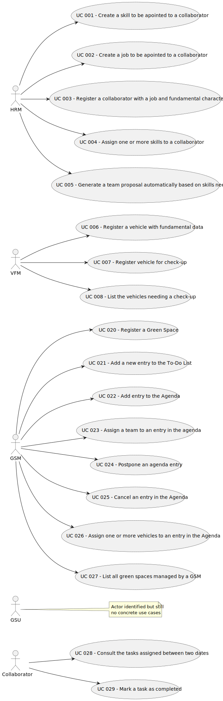

#  User Manual ☆

## 1.Table of contents

## Table of Contents

1. [Introduction](#1-introduction)

    1.1 [Glossary](#11-glossary)

   1.2 [Purpose and Scope of the application](#12-purpose-and-scope-of-the-application)
2. [System Overview](#2-system-overview)

    2.1 [Overall description](#21-overall-description)

    2.2 [Structure of the application](#22-structure-of-the-application)

3. [System Features](#3-system-features)

   3.1 [User Features - Main Menu](#31-user-features---main-menu)

    3.1.1 [Login UI](#311-login-ui)

    3.2.2 [Development Team](#312-development-team)

    3.1.3 [HRM Menu](#313-hrm-menu)

    3.1.3.1 [Register a New Skill (Single Skill Input)](#3131-register-a-new-skill-single-skill-input)

    3.1.3.2 [Register a New Skill (Multiple Skill Input)](#3132-register-a-new-skill-multiple-skill-input)

     3.1.3.3 [Register a New Job](#3133-register-a-new-job)

    3.1.3.4 [Register New Collaborator](#3134-register-new-collaborator)

     3.1.3.5 [Assign Skills](#3135-assign-skills)

    3.1.3.6 [Create a Team Proposal](#3136-create-a-team-proposal)

    3.1.4 [VFM Menu](#314-vfm-menu)

    3.1.4.1. [Register New Vehicle](#3141-register-new-vehicle)

    3.1.4.2 [Update a Vehicle's Current KM](#3142-update-a-vehicles-current-km)
    
    3.1.4.3 [Register Vehicle Check-up](#3143-register-vehicle-check-up)

    3.1.4.4 [List of Vehicles Needing Check-Up](#3144-list-of-vehicles-needing-check-up)

## 1. Introduction

### 1.1 Glossary

| **_TEA_** (EN)                                     | **_TEA_** (PT)                   | **_Description_** (EN)                                                                                                                                                                                                                 |                                       
|:---------------------------------------------------|----------------------------------|:---------------------------------------------------------------------------------------------------------------------------------------------------------------------------------------------------------------------------------------|
| **Calendar**                                       | Calendário                       | A diary is a mechanism for organization of the week's work. Each diary entry will define a task, a team that will carry out that task and a certain  time interval.                                                                    |
| **Collaborator**                                   | Colaborador                      | An systemUser who carries out _tasks_ such as design, maintenance or construction.                                                                                                                                                       |
| **Diagrama de sequência de sistema (SSD Diagram)** | Diagrama de sequência de sistema | System Sequence Diagram, is a visual representation used to depict the flow of interactions between external actors and the system under consideration.                                                                                |
| **Domain Model**                                   | Modelo de domínio                | A domain model is a visual representation used to depict the essential entities, attributes, relationships, and behaviors within a specific problem domain.                                                                            |
| **Equipment**                                      | Equipamento                      | The equipment includes sprayers, lifting platforms, chainsaws, brush cutters, blowers, ladders, cisterns and the various elements that can be attached to tractors, such as disc harrows, weeders, aerators and scarifiers.            |
| **Garden**                                         | Jardim                           | A garden is a small green space, it can have trees, it may have a basic _irrigation system._                                                                                                                                           |
| **Green spaces**                                   | Espaços verdes                   | A green space is a vegetated area, those can be forests, trees, big parks, allotments, small parks.                                                                                                                                    |
| **GSM**                                            | Gestor dos Espaços Verdes        | Green Spaces Manager, person responsible for managing green spaces.                                                                                                                                                                    |
| **GSU**                                            | Utilizador dos Espaços Verdes    | Person who uses the green spaces managed by the organization, they can make comments and report faults through the portal.                                                                                                            |
| **HRM**                                            | Gestor de Recursos Humanos       | Human Resources Manager, a person who plans, coordinates, and directs the administrative functions of an organization.                                                                                                                 |
| **Irrigation system**                              | Sistema de rega                  | The irrigation system is the system implemented for watering the different _green spaces._                                                                                                                                             |
| **Job**                                            | Emprego                          | A job is a collaborator´s main occupation and each collaborator must have one job.                                                                                                                                                     |
| **Large-sized park**                               | Parque de grandes dimensões      | A Large-sized park is a _green space_ with multiple functions with diverse garden spaces, and woods including varied equipment and services.                                                                                            |
| **Machine**                                        | Máquina                          | The machines include tractors, backhoe loaders and rotating machines, lawn mowers, among others.                                                                                                                                       |
| **Medium-Sized park**                              | Parque de tamanho médio          | A medium-sized park is a _green space_ with a few hundred or thousands of square meters with a wooded garden area, some infrastructures, drinking fountains, irrigation systems and lighting.                                          |
| **MS**                                             | MusgoSublime                     | Company in charge of managing the different _green spaces._                                                                                                                                                                            |
| **Skills**                                         | Capacidades                      | A Skill is an attribute given to a _collaborator_, when registered, a collaborator is given one or more skills that will define in which groups of work he will be working.                                                            |
| **Software Application**                           | Aplicação de _Software_          | Is a computer program designed to help people perform an activity.                                                                                                                                                                     |
| **SSD Diagram**                                    | Diagrama de sequência de sistema | System Sequence Diagram, is a visual representation used to depict the flow of interactions between external actors and the system under consideration.                                                                                |
| **System User**                                    | Utilizadores do sistema          | Individuals who interact with the system, including HRM, FM, Collaborators, GSM, GSU.                                                                                                                                                  |
| **Task**                                           | Tarefa                           | Tasks are carried out on an occasional or regular basis in one or more green spaces, for example: tree pruning; installation of an irrigation system; installation of a lighting system.                                               |
| **Team**                                           | Equipa                           | Teams are temporary associations of employees who will carry out a set of tasks in one or more green spaces.                                                                                                                           |
| **Team Proposal**                                  | Proposta de equipa               | A proposal generated automatically by the system for the formation of teams, typically created by the Human Resources Manager (HRM) based on the skills and availability of collaborators to carry out specific tasks in green spaces. |
| **User Portal**                                    | Portal do Utilizador             | The user portal is used by the _GSU_ to report faults and leave comments.                                                                                                                                                              |
| **US**                                             | História de utilizador           | User story, a tool in Agile software development used to capture a description of a software feature from a user's perspective.                                                                                                        |
| **VFM**                                            | Gestor da Frota                  | Vehicle and Equipment Fleet Manager, a person that manages the fleet park, the machines, equipment, and vehicles, ensuring their good condition and assigning them to the tasks to be carried out.                                    |
| **Vehicle**                                        | Veículo                          | Vehicles are needed to carry out the tasks assigned to the teams as well as to transport machines and equipment. This type of vehicle can be only for passengers or mixed, light or heavy, open box or closed vans or trucks.          |.                                                                                                                                                                     |

### 1.2 Purpose and Scope of the application

In an increasingly urbanized world, access to green spaces plays a vital role in enhancing the quality of life for residents. 

Recognizing the significance of green spaces in urban contexts, MusgoSublime (MS) is working to effectively manage these spaces. However, they encounter some obstacles when it comes to efficiently organizing, building, and sustaining urban green spaces.

Therefore, MS has adopted this Software that serves as a comprehensive solution to the innumerable challenges encountered by this organization and others involved in similar endeavours.

This manual is designed to provide you with all the necessary information to effectively utilize the application to manage green spaces for collective use in urban environments. 

Whether you are a Human Resources Manager (HRM), a Vehicle and Equipment Fleet Manager (VFM), a Collaborator, a Green Spaces Manager (GSM) or a Green Spaces User (GSU), this manual will guide you through the features and functionalities of the system.

## 2. System Overview

 ### 2.1 Overall description

Through innovative approaches and meticulous administration, this application delivers a comprehensive software solution for planning, constructing, and maintaining green spaces. 

In order to do it, the system integrates various functionalities and tools tailored to the specific needs of the organizations, which are:
*  **Collaborator Management:** Human Resources Managers can efficiently manage the workforce by registering new collaborators, assigning jobs, and managing skills. This functionality enables effective allocation of resources based on expertise and availability.

*  **Team Proposal Generation:** Human Resources Managers can generate team proposals automatically based on predefined criteria such as maximum team size and required skills. This feature streamlines the process of forming teams for specific tasks and projects.

* **Vehicle and Equipment Management:**  Fleet Managers can oversee the organization's fleet of vehicles, machinery, and equipment. This includes registering vehicles, tracking maintenance schedules, and ensuring optimal utilization of resources.

* **Agenda Management:** The system provides a centralized platform for scheduling tasks and activities within green spaces. Users can plan and coordinate various maintenance activities, ensuring timely execution and efficient resource allocation.

* **Green Spaces User Portal:** A user-friendly portal allows Green Spaces Users to interact with the system by posting comments, reporting faults, and providing feedback on the condition of green spaces. This fosters community engagement and enables proactive maintenance and improvement of green areas.

### 2.2 Structure of the application 

The following diagram illustrates an abstract structure of the application and makes clear the relation between each role and the feature.

## 3. System Features 
### 3.1. User Features - Main Menu
### 3.1.1 Login UI
**Step 1**: Select “Do Login” by the corresponding number (“1”)

**Step 2**: Enter your credentials. Depending on your role, you will be directed to either the HRM or VFM menu.

**Step 3**: The menu

**HRM Menu**

**VFM Menu:**

### 3.1.2 Development Team

**Step 1**: To familiarize yourself with the team and their contact information, choose option number ("2")

### 3.1.3 Hmr menu
### 3.1.3.1 Register a new skill(single skill input)
**Step 1**: To register a new skill, select option number ("1")

**Step 2** Now select option number ("1") again

**Step 3** Write the skill that you want to register

**Step 4** If you have followed the previous steps, it will appear a success message and you will be redirected to the HRM menu again

### 3.1.3.2 Register a new skill (multiple skill input)
**Step 1**: To register a new skill, select option number ("1") in the HRM menu

**Step 2** Now select option number ("2") 

**Step 3** In a text file, write the skills that you want to register

**Step 4** Now copy the path

**Step 5** If you have followed the previous steps, it will appear a success message and you will be redirected to the HRM menu again

### 3.1.3.1 Register a new skill(single skill input)
**Step 1**: To register a new skill, select option number ("1")

**Step 2** Now select option number ("1") again

**Step 3** Write the skill that you want to register

**Step 4** If you have followed the previous steps, it will appear a success message and you will be redirected to the HRM menu again

### 3.1.4 Register a new job 
**Step 1** To register a new job, select option number ("2")

**Step 2** Then write the job name 

**Step 3** If you have followed the previous steps, a success message will appear and you will be redirected to the HRM menu again

### 3.1.6 Register New Collaborator

**Step 1** To register a new collaborator select option number ("3")

**Step 2**  Then choose one job

**Step 3** Now choose the document type that you want to fill out

**Step 4** Fill out all the criteria

**Step 5** If you have followed the previous steps, a success message will appear and you will be redirected to the HRM menu again

### 3.1.6 Assign skills

**Step 1** To assign skills to a collaborator select option number ("4")

**Step 2**  Start by choosing the collaborator that you want to assign skills

**Step 3** Choose the skills to assign to the collaborator. Enter the desired skill number.
To stop adding skills, enter 0.

**Step 4** If you have followed the previous steps, it will appear a success message and you will be redirected to the HRM menu again

### 3.1.7 Create a Team Proposal

**Step 1** To create a team proposal select option number ("5")

**Step 2**  Start by typing the maximum and the minimum number of collaborators

**Step 3** Enter the index of the skill you want to add (or type 'done' to finish): type 'exit' to cancel.

**Step 4** If you have followed the previous steps, a success message will appear and you will be redirected to the HRM menu again

### 3.1.4 Vfm menu
### 3.1.4.1 Register New Vehicle
**Step 1**: To register a new vehicle, select option number ("1")

**Step 2** Now select the vehicle type

**Step 3** Write the skill that you want to register

**Step 4** Now fill out all the criteria

**Step 5** If you have followed the previous steps, a success message will appear and you will be redirected to the VFM menu again

### 3.1.4.2 Update a Vehicle's Current KM
**Step 1**: To update a vehicle's current KM, select option number ("2")

**Step 2** Now select the vehicle that you want to update

**Step 3** Now enter the new value and a success message will appear and then you will be redirected to the VFM menu again

### 3.1.4.3 Register Vehicle Check-up
**Step 1**: To register vehicle check-up, select option number ("3")

**Step 2** Now select the vehicle that you want to do the register check-up

**Step 3** Now fill out the new criteria and a success message will appear, then you will be redirected to the VFM menu again

### 3.1.4.4 List of Vehicles Needing Check-Up
**Step 1**: To see the list of vehicle needing check-up, select option number ("4"). Then you will be redirected to the VFM menu again

    

 

