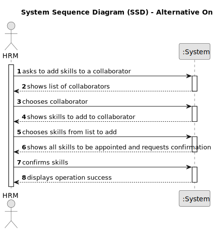

# US004 - Assign one or more skills

## 1. Requirements Engineering

### 1.1. User Story Description

As HRM, I want to atribute one or more skills to a collaborator.

### 1.2. Customer Specifications and Clarifications 

**From the specifications document:**

>   Each collaborator has a set of skills that enables him to perform/take on certain tasks/responsabilities.

>   The skills atributed to each collaborator are crucial in the team formation process.

**From the client clarifications:**

> **Question:** Is there a minimum or maximum number of skills appointed to a collaborator?
>
> **Answer:** No, there are no limits.

> **Question:** Is there any special characteristic (e.g. a specific job )?
>
> **Answer:** No, there are no correlations with any characteristics of the collaborator.

> **Question:** Do the skills atributed to the collaborator depend on his job?
>
> **Answer:** No, there is no association, it totally depends on the CV of the collaborator.

### 1.3. Acceptance Criteria

* A collaborator should be selected

### 1.4. Found out Dependencies

* There is a dependency on "US001 - Register a skill" as there must be at least one skill to atribute a skill to a collaborator.
* There is a deoendancy on "US003 - Register a collaborator" as there must be at least one collaborator whom can be atributed skills.

### 1.5 Input and Output Data

**Input Data:**

* Selected data:
    * collaborator 
    * one/multiple skills

**Output Data:**

* List of collaborator's current skills
* (In)Success of the operation

### 1.6. System Sequence Diagram (SSD)

#### Alternative One

### 1.7 Other Relevant Remarks

* None