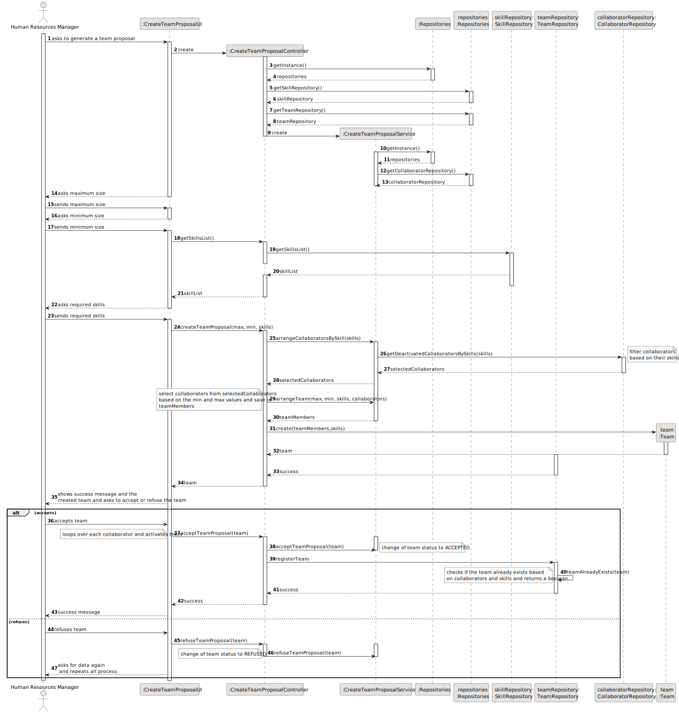

# US005 - Generate a Team Proposal

## 3. Design - User Story Realization 

### 3.1. Rationale

_**Note that SSD - Alternative One is adopted.**_

| Interaction ID                                                      | Question: Which class is responsible for...                  | Answer                                           | Justification (with patterns)                                                                                 |
|:--------------------------------------------------------------------|:-------------------------------------------------------------|:-------------------------------------------------|:--------------------------------------------------------------------------------------------------------------|
| Step 1 (Ask to generate a team proposal) 		                         | 	... interacting with the actor?                             | CreateTeamProposalUI                             | Pure Fabrication: there is no reason to assign this responsibility to any existing class in the Domain Model. |
| 			  		                                                             | 	... coordinating the US?                                    | CreateTeamProposalController                     | Controller.                                                                                                   |
| 	 Step 2 (Request data(max and min size))   		  		                  | 	... displaying the form for input data?                     | CreateTeamProposalUI                             | Pure Fabrication.                                                                                             |
|
| Step 3 (Type data)		                                         		  		 | ... validating data locally?                                 | CreateTeamProposalUI                             | IE: knows the inputted data.                                                                                  |
| 	Step 4 (Show skill list and asks to select them)		   		            | 		...getting the skills list?   					                        | SkillRepository                                  | IE: has the data.                                                                                             |
| 			  		                                                             | 	...displaying the list and form for input data?				         | CreateTeamProposalUI                             | Pure Fabrication.                                                                                             |
|                                                                     | 							                                                      |                                                  |                                                                                                               || 	...saving the inputted data?                 | Task                         | IE: object created in step 1 has its own data.                                                                |
| 		Step 5 (Select Skills)                                            | 	...storing the selected data temporarily?                   | CreateTeamProposalUI                             | Pure Fabrication.                                                                                             |
| 		        Step 6 (Get Collaborators for the team)                   | 	... getting the list of available collaborators?            | CollaboratorRepository                           | IE: contains all the registered collaborators.                                                                |
| 	                                                                   | 		... filtering the list of available collaborators?					    | CreateTeamProposalService                        | Service, handles business logic for selecting collaborators based on skills and availability.                 |                              |                                                                                                               |              
| Step 6  	(Register a Team)	                                         | 	... registering a team with selected collaborators?         | TeamRepository                                   | IE: responsible for managing teams and their creation.                                                        | 
| 			  		                                                             | 	... checking if the team already exists?                    | TeamRepository                                   | IE: handles operations related to team existence.                                                             | 
| 		Step 7 (Displays status of operation) 		  		                      | ... informing operation success?                             | CreateTeamProposalUI                             | Pure Fabrication.                                                                                      | 

### Systematization ##

According to the taken rationale, the conceptual classes promoted to software classes are: 
* Team

Other software classes (i.e. Pure Fabrication) identified: 

* CreateTeamProposalUI
* CreateTeamProposalController
* CreateTeamProposalService
* CollaboratorStatus

## 3.2. Sequence Diagram (SD)

### Full Diagram

This diagram shows the full sequence of interactions between the classes involved in the realization of this user story.

## 3.3. Class Diagram (CD)

