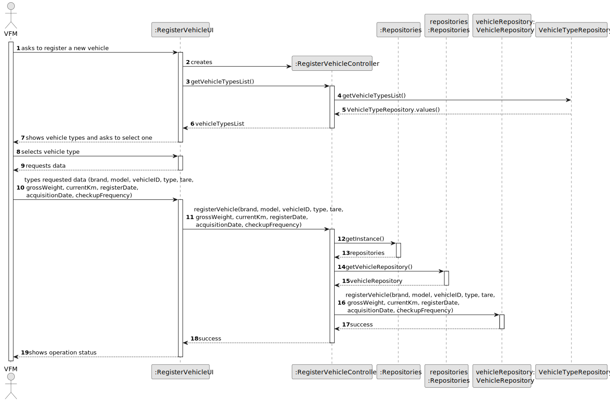
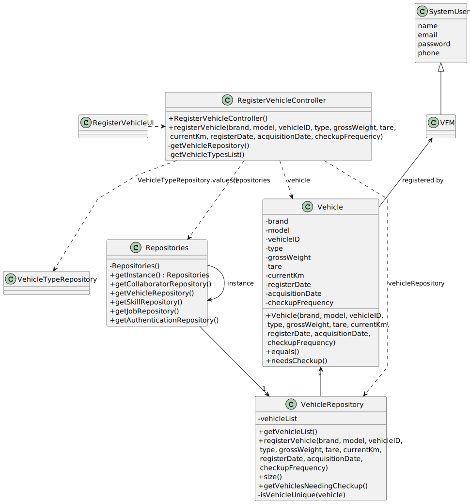

# US003 - Register a collaborator

## 3. Design - User Story Realization

### 3.1. Rationale

_**Note that SSD - Alternative One is adopted.**_

| Interaction ID                                                                                                                         | Question: Which class is responsible for...            | Answer                    | Justification (with patterns)                                                                                             |
|:---------------------------------------------------------------------------------------------------------------------------------------|:-------------------------------------------------------|:--------------------------|:--------------------------------------------------------------------------------------------------------------------------|
| Step 1 (Asks to register a new vehicle)  		                                                                                            | 	... interacting with the actor?                       | RegisterVehicleUI         | Pure Fabrication: there is no reason to assign this responsibility to any existing class in the Domain Model.             |
| 			  		                                                                                                                                | 	... coordinating the US?                              | RegisterVehicleController | Controller                                                                                                                |
| Step 2 (Shows vehicle types list and asks to select one) 		                                                                            | 	...getting the vehicle types list?						              | VehicleTypeRepository     | IE: has the data                                                                                                          |
| 		                                                                                                                                     | 	...displaying the list and form for input data?						 | RegisterVehicleUI         | Pure Fabrication                                                                                                          |
| Step 3 (Selects vehicle type) 		                                                                                                       | 	...storing the selected data temporarily?             | RegisterVehicleUI         | Pure Fabrication                                                                                                          | | 	...accepting input?                                   | RegisterVehicleUI         | IE: is responsible for user interaction                                                                                         |
| Step 4 (requests data (Brand, Model, Vehicle Id, Tare,Gross Weight, Current Km, Register Date, Acquisition Date, Checkup Frequency))		 | 	...displaying the form for input data?						          | RegisterVehicleUI         | Pure Fabrication                                                                                                          |
| Step 5 (Types data)                                                                                                                    | 	...validating data locally?                           | RegisterVehicleUI         | IE: knows the inputted data                                                                                               |
| 		                                                                                                                                     | 	...instantiating a new collaborator?                  | VehicleRepository         | Pure Fabrication: the VehicleRepository is the only class that follows the rules to be a creator class (contains Vehicle) |
|                                                                                                                                        | ...saving inputted data?                               | Vehicle                   | IE: the created object has its own data.                                                                                  |
|                                                                                                                                        | ...validate the data globally?                         | VehicleRepository         | IE: knows all the vehicles                                                                                                |
|                                                                                                                                        | ...registering the collaborator?                       | VehicleRepository         | IE: contains all the registered collaborators                                                                             |
| Step 6 (Displays status of operation)		                                                                                                | 	...informing operation success?                       | VehicleCollaboratorUI     | Pure Fabrication                                                                                                          |

### Systematization ##

According to the taken rationale, the conceptual classes promoted to software classes are:

* Vehicle

Other software classes (i.e. Pure Fabrication) identified:

* RegisterVehicleUI
* RegisterVehicleController
* VehicleRepository
* VehicleTypeRepository

## 3.2. Sequence Diagram (SD)

### Full Diagram

This diagram shows the full sequence of interactions between the classes involved in the realization of this user story.

## 3.3. Class Diagram (CD)

