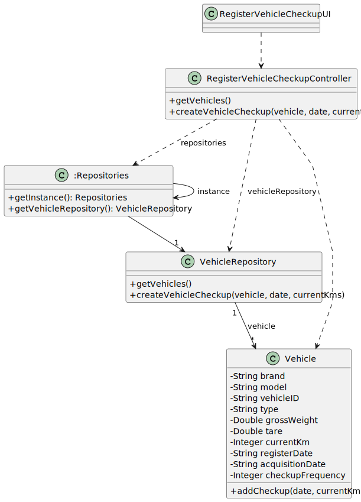

# US006 - Create a Task 

## 3. Design - User Story Realization 

### 3.1. Rationale

_**Note that SSD - Alternative One is adopted.**_

| Interaction ID                                              | Question: Which class is responsible for...     | Answer                           | Justification (with patterns)                                                                                 |
|:------------------------------------------------------------|:------------------------------------------------|:---------------------------------|:--------------------------------------------------------------------------------------------------------------|
| Step 1 (Ask to register a vehcile check-up 		               | 	... interacting with the actor?                | RegisterVehicleCheckupUI         | Pure Fabrication: there is no reason to assign this responsibility to any existing class in the Domain Model. |
| 			  		                                                     | 	... coordinating the US?                       | RegisterVehicleCheckupController | Controller.                                                                                                   |
| 			 Step 2 (Show vehicles list and asks to select one) 	 		 | 	...getting the vehicles list?	                 | VehicleRepository                | IE: has the data.                                                                                             |
| 			  		                                                     | ...displaying the list and form for input data? | RegisterVehicleCheckupUI         | Pure Fabrication.                                                                                             |
|                                                                                           
| 	 Step 3 (Select vehicle) 		  		                            | 		...storing the selected data temporarily? 		  | RegisterVehicleCheckupUI  			    | Pure Fabrication.                                                                                             |
| 	 Step 4 (Request data (date and currentKms)	  		           | 		...displaying the form for input data?						  | RegisterVehicleCheckupUI         | Pure Fabrication.                                                                                             |
| Step 5 (Type data)                                          | 	...validating data locally?                    | RegisterVehicleCheckupUI         | IE: knows the inputted data.                                                                                  |
| Step 6 (Create a vehicle check-up)                          | 					...creating a check-up?   		               | VehicleRepository                | IE: responsible for managing vehicle check-ups.                                                               |  
|                                                             | ...validate the data globally?                  | VehicleRepository                | IE: knows all the vehicles                                                                                                |
| 	                                                           | 	 ...saving inputted data?                      | Vehicle                          | IE: the created object has its own data.                                                                      |
|                                                             | ...updating last check-up?                      | VehicleCheckup|  IE: the created object has its own data.   |
| Step 7 (Displays status of operation) 		                    | 	... informing operation success?               | RegisterVehicleCheckupUI         | Pure Fabrication.                                                                          | 

### Systematization ##

According to the taken rationale, the conceptual classes promoted to software classes are: 

* Vehicle
* VehicleCheck-up

Other software classes (i.e. Pure Fabrication) identified: 

* RegisterVehicleCheckupUI 
* RegisterVehicleCheckupController

## 3.2. Sequence Diagram (SD)

### Full Diagram

This diagram shows the full sequence of interactions between the classes involved in the realization of this user story.

## 3.3. Class Diagram (CD)

