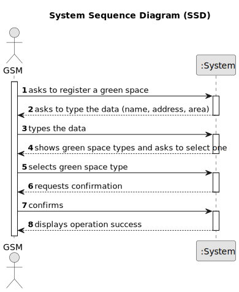

# US020 - Register a Green Space

## 1. Requirements Engineering

### 1.1. User Story Description

As a GSM, I want to register a Green Space. 

### 1.2. Customer Specifications and Clarifications 

**From the specifications document:**

> In order to register a green space the user needs to introduce a name, address, area and green space type (garden, medium-sized park or large-sized park).

**From the client clarifications:**

> **Question:** In which unit should the area be measured in?
>
> **Answer:** Areas are measured in hectares.

> **Question:** Can two Green Spaces have the same name?
>
> **Answer:** No.

> **Question:** Can two Green Spaces have the same address?
>
> **Answer:** No.
### 1.3. Acceptance Criteria

* The area is measured in hectares and must be a number.
* All required fields must be filled.
* The green space's name and address must be unique

### 1.4. Found out Dependencies

* n/a

### 1.5 Input and Output Data

**Input Data:**

* Typed Data:
    * Name
    * Area
    * Address
* Selected Data:
    * Green Space Type

**Output Data:**

* Success message

### 1.6. System Sequence Diagram (SSD)

### 1.7 Other Relevant Remarks

* Each GSM has his own Green Spaces and can't access other GSMs' green spaces.