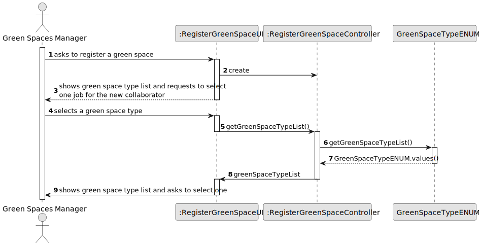
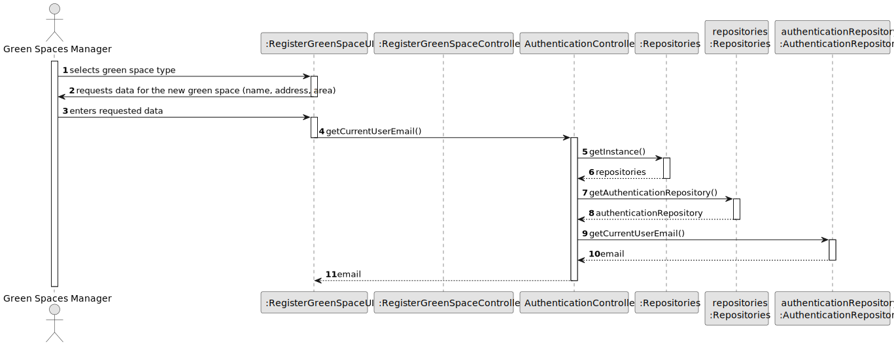
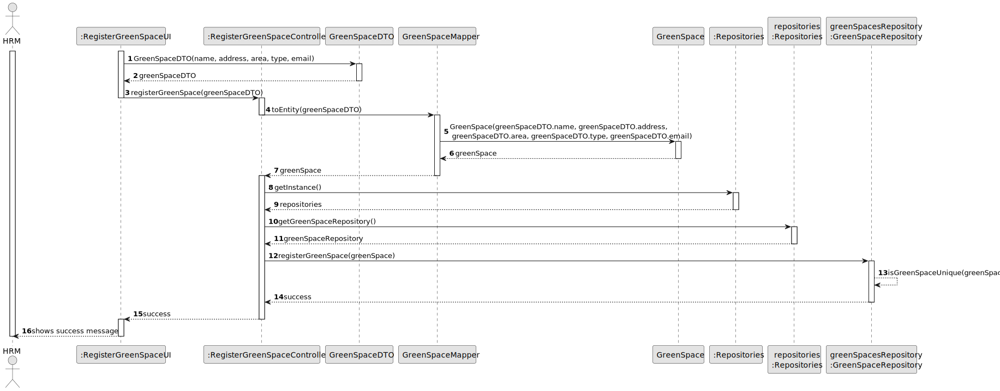

# US020 - Register a Green Space

## 3. Design - User Story Realization

### 3.1. Rationale

| Interaction ID                                          | Question: Which class is responsible for... | Answer                       | Justification (with patterns)                                                                                 |
|:--------------------------------------------------------|:--------------------------------------------|:-----------------------------|:--------------------------------------------------------------------------------------------------------------|
| Step 1 (asks to register a new Green Space)             | ...interacting with the actor?              | GreenSpaceUI                 | Pure Fabrication: there is no reason to assign this responsibility to any existing class in the Domain Model. |
|                                                         | ...coordinating the US?                     | RegisterGreenSpaceController | Controller                                                                                                    |
| Step 2 (requests data(name, address, area, type))       | ...displaying the input form?               | GreenSpaceUI                 | Pure Fabrication                                                                                              |
| Step 3 (types the data)                                 | ...storing the data temporarily?            | GreenSpaceUI                 | IE: has the data                                                                                              |
| Step 4 (shows green space types and asks to select one) | ...retrieving the Green Space types?        | GreenSpaceTypeENUM           | IE: has the data                                                                                              |
|                                                         | ...displaying Green Space types list?       | GreenSpaceUI                 | Pure Fabrication                                                                                              |
| Step 5 (selects the green space)                        | ...storing the data temporarily?            | GreenSpaceUI                 | IE: has the data                                                                                              |
| Step 6 (requests confirmation)                          | ...displaying confirmation button?          | GreenSpaceUI                 | Pure Fabrication                                                                                              |
| Step 6 (confirms)                                                        | ...creating the Green Space DTO?            | GreenSpaceUI                 | IE: has the data                                                                                              |
|                                                         | ...transforming DTO to entity?              | GreenSpaceMapper             | Pure fabrication: handles transformation logic                                                                |
|                                                         | ...saving inputted data?                    | GreenSpace                   | IE: The created object has its own data                                                                       |
|                                                         | ...validating the data globally?            | GreenSpaceRepository         | IE: has all GreenSpaces                                                                                       |
|                                                         | ...registering the GreenSpace?              | GreenSpaceRepository         | IE: has the data                                                                                              |
| Step 7 (displays message of (in)success)                | ...displaying the result of the operation?  | GreenSpaceUI                 | Pure Fabrication                                                                                              |

### Systematization ##

According to the taken rationale, the conceptual classes promoted to software classes are:

* GreenSpace

Other software classes (i.e. Pure Fabrication) identified:

* GreenSpaceUI
* RegisterGreenSpaceController
* GreenSpaceRepository
* GreenSpaceMapper
* GreenSpaceTypeENUM

## 3.2. Sequence Diagram (SD)

### Selection of Green Space Type

### Green Space Data Entry and User Authentication

### Green Space DTO Creation and Registration

### Full Diagram

This diagram shows the full sequence of interactions between the classes involved in the realization of this user story.

## 3.3. Class Diagram (CD)

