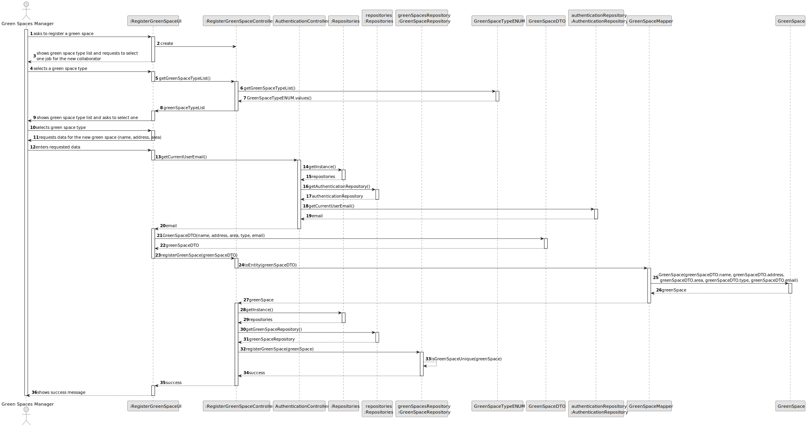
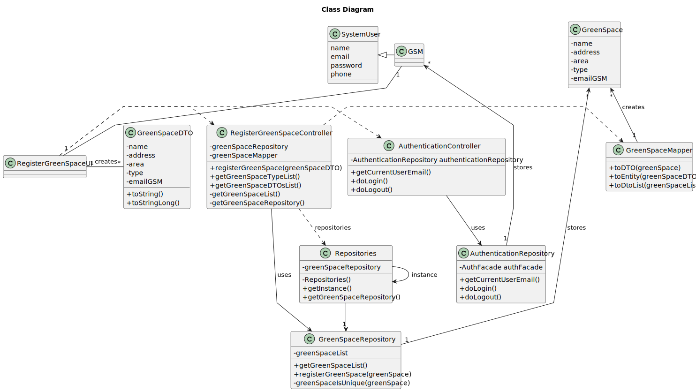

# US020 - Register a Green Space

## 3. Design - User Story Realization

### 3.1. Rationale

| Interaction ID                                             | Question: Which class is responsible for...            | Answer                       | Justification (with patterns)                                                                                                   |
|:-----------------------------------------------------------|:-------------------------------------------------------|:-----------------------------|:--------------------------------------------------------------------------------------------------------------------------------|
| Step 1 (Asks to register a new green space)  		            | 	... interacting with the actor?                       | RegisterGreenSpaceUI         | Pure Fabrication: there is no reason to assign this responsibility to any existing class in the Domain Model.                   |
| 			  		                                                    | 	... coordinating the US?                              | RegisterGreenSpaceController | Controller                                                                                                                      |
| Step 2 (Shows green space types and asks to select one) 		 | 	...getting the green space type list?						           | GreenSpaceTypeRepository     | IE: has the data                                                                                                                |
| 		                                                         | 	...displaying the list and form for input data?						 | RegisterGreenSpaceUI         | Pure Fabrication                                                                                                                |
| Step 3 (Selects green space type) 		                       | 	...storing the selected data temporarily?             | RegisterGreenSpaceUI         | Pure Fabrication                                                                                                                | |  
| Step 6 (requests data (name, address, area))		             | 	...displaying the form for input data?						          | RegisterGreenSpaceUI         | Pure Fabrication                                                                                                                |
| Step 7 (Types data)                                        | 	...validating data locally?                           | RegisterGreenSpaceUI         | IE: knows the inputted data                                                                                                     |
| 		                                                         | 	...instantiating a new green space?                   | GreenSpaceRepository         | Pure Fabrication: the GreenSpaceRepository is the only class that follows the rules to be a creator class (contains GreenSpace) |
|                                                            | ...saving inputted data?                               | GreenSpace                   | IE: the created object has its own data.                                                                                        |
|                                                            | ...validate the data globally?                         | GreenSpaceRepository         | IE: knows all the vehicles                                                                                                      |
|                                                            | ...registering the collaborator?                       | GreenSpaceRepository         | IE: contains all the registered collaborators                                                                                   |
| Step 8 (Displays status of operation)		                    | 	...informing operation success?                       | RegisterGreenSpaceUI         | Pure Fabrication                                                                                                                |

### Systematization ##

According to the taken rationale, the conceptual classes promoted to software classes are:

* GreenSpace

Other software classes (i.e. Pure Fabrication) identified:

* RegisterGreenSpaceUI
* RegisterGreenSpaceController
* GreenSpaceRepository
* GreenSpaceTypeRepository

## 3.2. Sequence Diagram (SD)

### Full Diagram

This diagram shows the full sequence of interactions between the classes involved in the realization of this user story.

## 3.3. Class Diagram (CD)

