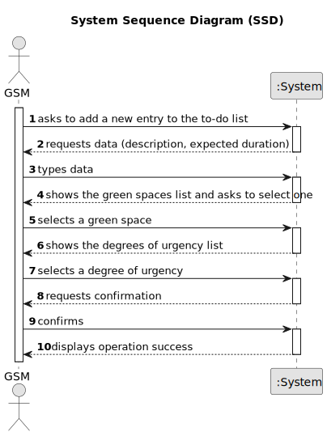

# US021 - Add a new entry to the To-Do List

## 1. Requirements Engineering

### 1.1. User Story Description

As a GSM, I want to add a new entry to the To-Do List.

### 1.2. Customer Specifications and Clarifications 

**From the specifications document:**

> The entries in the To-Do List describe the required task, the degree of urgency (High, Medium, and Low), and the approximate expected duration

**From the client clarifications:**

> **Question:** What time unit should be used for the duration of the task?
>
> **Answer:** Hours and/or days.

> **Question:** What's the default state of a To-Do List Entry?
>
> **Answer:** "Pending" as default for to-do list entries and "Planned" as default for Agenda entries sounds good.

### 1.3. Acceptance Criteria

* The new entry must be associated with a green space managed by the GSM.
* The green space for the new entry should be chosen from a list presented to the GSM.

### 1.4. Found out Dependencies

* There is a dependency on "US020 - Register a Green Space" an entry must have a green space associated to itself.

### 1.5 Input and Output Data

**Input Data:**

* Typed Data:
    * Entry description
    * Expected duration
* Selected Data:
    * Green Space
    * Degree of urgency
  
**Output Data:**

* (In)Success of the operation

### 1.6. System Sequence Diagram (SSD)

### 1.7 Other Relevant Remarks

* n/a