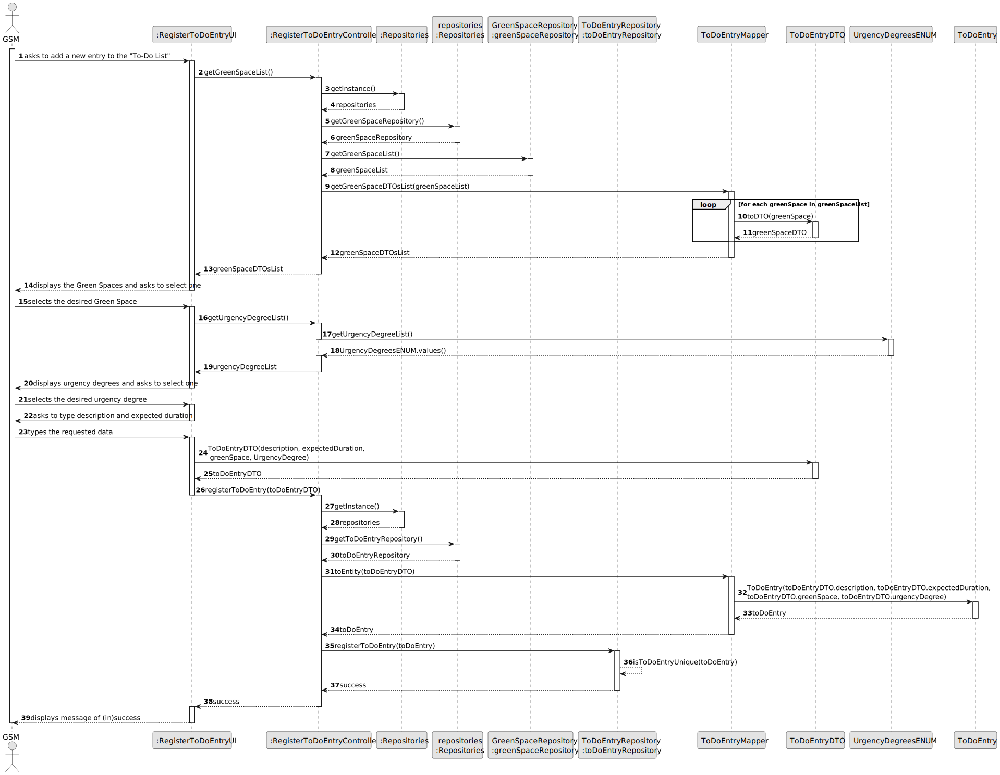
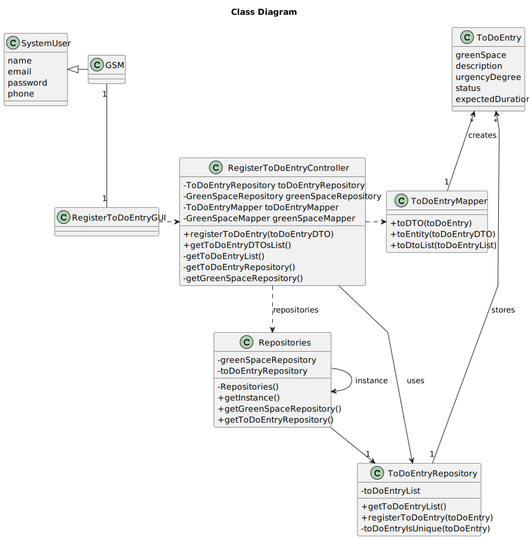

# US008 - List the vehicles needing the check-up

## 3. Design - User Story Realization 

### 3.1. Rationale

_**Note that SSD - Alternative One is adopted.**_

| Interaction ID                                         | Question: Which class is responsible for... | Answer                      | Justification (with patterns)                                                                                 |
|:-------------------------------------------------------|:--------------------------------------------|:----------------------------|:--------------------------------------------------------------------------------------------------------------|
| Step 1 (asks to register a new To-Do List Entry)       | ...interacting with the actor?              | RegisterToDoEntryUI         | Pure Fabrication: there is no reason to assign this responsibility to any existing class in the Domain Model. |
|                                                        | ...coordinating the US?                     | RegisterToDoEntryController | Controller                                                                                                    |
| Step 2 (requests data(description, expected duration)) | ...displaying the input form?               | RegisterToDoEntryUI                | Pure Fabrication                                                                                              |
| Step 3 (types the data)                                | ...storing the data temporarily?            | RegisterToDoEntryUI                | IE: has the data                                                                                              |
| Step 4 (shows urgency degrees and asks to select one)  | ...retrieving the Green Space types?        | UrgencyDegreeENUM           | IE: has the data                                                                                              |
|                                                        | ...displaying Urgency Degree list?          | RegisterToDoEntryUI         | Pure Fabrication                                                                                              |
| Step 5 (selects the urgency degree)                    | ...storing the data temporarily?            | RegisterToDoEntryUI         | IE: has the data                                                                                              |
| Step 4 (shows green spaces and asks to select one)     | ...retrieving the Green Space list?         | GreenSpaceRepository        | IE: has the data                                                                                              |
|                                                        | ...transforming list into DTOs list?        | GreenSpaceMapper            | Pure Fabrication: handles transformation logic                                                                |
|                                                        | ...displaying Green Space list?             | RegisterToDoEntryUI         | Pure Fabrication                                                                                              |
| Step 5 (selects the green space)                       | ...storing the data temporarily?            | RegisterToDoEntryUI         | IE: has the data                                                                                              |
| Step 6 (requests confirmation)                         | ...displaying confirmation button?          | RegisterToDoEntryUI         | Pure Fabrication                                                                                              |
| Step 6 (confirms)                                      | ...creating the To-Do List Entry DTO?       | RegisterToDoEntryUI         | IE: has the data                                                                                              |
|                                                        | ...transforming DTO to entity?              | ToDoEntryMapper             | Pure fabrication: handles transformation logic                                                                |
|                                                        | ...saving the data?                         | ToDoEntry                   | IE: The created object has its own data                                                                       |
|                                                        | ...validating the data globally?            | ToDoEntryRepository         | IE: has all To-Do List Entries                                                                                |
|                                                        | ...registering the To-Do List Entry??       | ToDoEntryRepository         | IE: has the data                                                                                              |
| Step 7 (displays message of (in)success)               | ...displaying the result of the operation?  | RegisterToDoEntryUI         | Pure Fabrication                                                                                              |

According to the taken rationale, the conceptual classes promoted to software classes are: 

* GreenDpace
* ToDoEntry

Other software classes (i.e. Pure Fabrication) identified: 

*  RegisterToDoEntryUI
*  RegisterToDoEntryController
*  ToDoEntryRepository
*  UrgencyDegreeENUM
*  GreenSpaceRepository
*  GreenSpaceMapper

## 3.2. Sequence Diagram (SD)
### Full Diagram

This diagram shows the full sequence of interactions between the classes involved in the realization of this user story.

## 3.3. Class Diagram (CD)

