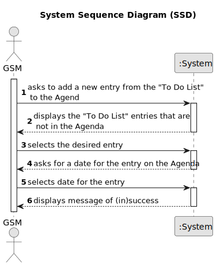

# US022 - Add entry to the Agenda

## 1. Requirements Engineering

### 1.1. User Story Description

As a GSM, I want to add an entry from the to do list to the Agenda. 

### 1.2. Customer Specifications and Clarifications 

**From the specifications document:**

> The entry in the agenda must have a name, an associated green space and a date for the task to be carried out 

**From the client clarifications:**

> **Question:**  Agenda entry has a target date, but is this target date supposed to be inputted upon transferring a task from the to-do list to the agenda, or is it supposed to be inputted upon creating the task in the to-do list?
>
> **Answer:** To-do list entries doesn't have dates!

> **Question:** During the last client meeting, we became aware that some tasks are meant to be reoccurring rather than occasional. Is this something that should be asked on creating the task in the to-do list? If so, what inputs should we expect from the user? The task's frequency in days?
>
> **Answer:** For the current proof-of-concept there is no need to distinguish between recurring and occasional tasks.

> **Question:** When the GSM plans a task (that was previously in To-Do) into the Agenda, what aditional data/information does he need to input when planning?
>
> **Answer:** The starting date for the task. Later the GSM will be able to add the Team and vehicles (if required).

> **Question:** When a new entry is added to the Agenda, the status of that task will be, by default, set to "planned", right?
>
> **Answer:** "Pending" as default for to-do list entries and "Planned" as default for Agenda entries, sounds good.

> **Question:** Regarding the US022, when we are registering an entry to the agenda, are the three inputs (selecting an existing task from the to-do list, starting date, and finishing date) sufficient?
>
> **Answer:** The starting date will be enough because the task already has the predicted duration.

> **Question:** Can I add an entry that is cuncurrent with an existing entry in the Agenda?
>
> **Answer:** Yes, because: a) there are many parks to manage b) different tasks can be executed at same time in the same park.
### 1.3. Acceptance Criteria

* The new entry must be associated with a green space man aged by the GSM.
* The new entry must exist in the To-Do list.
* The new entry on the agenda cannot be a duplicate.
* The new entry has to have a date in the future for it to be accepted.

### 1.4. Found out Dependencies

* There is a dependency on "US020 - Register a Green Space" as there must be at least one green space to associate an entry with one.
* There is a dependency on "US021 - Add entry to the To Do List" as there must be at least one to do item to select an entry from the To Do List.

### 1.5 Input and Output Data

**Input Data:**

* Selected data
  * entry from To Do List
  * date for new agenda entry

**Output Data:**

* Confirmation of (in)success of the operation

### 1.6. System Sequence Diagram (SSD)

### 1.7 Other Relevant Remarks

* none