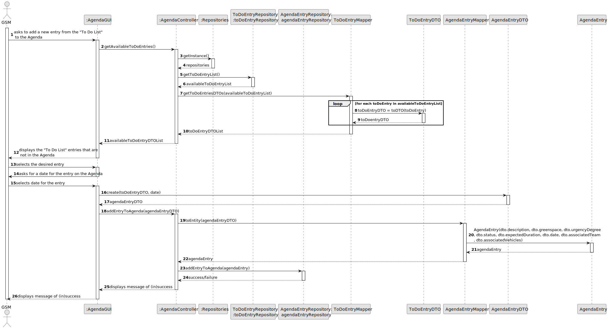
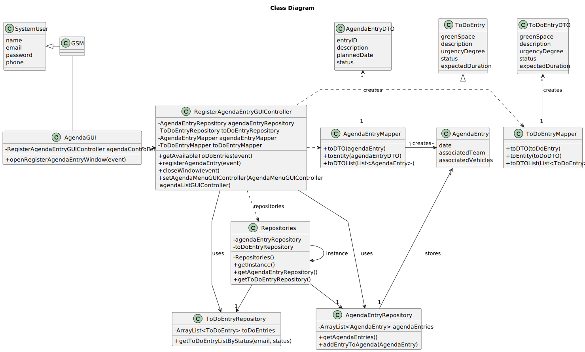

# US0022 - REGISTER AN AGENDA ENTRY

## 3. Design - User Story Realization 

### 3.1. Rationale

_**Note that SSD - Alternative One is adopted.**_

| Interaction ID                                                                                                     | Question: Which class is responsible for...                | Answer                          | Justification (with patterns)                                                                                            |
|:-------------------------------------------------------------------------------------------------------------------|:-----------------------------------------------------------|:--------------------------------|:-------------------------------------------------------------------------------------------------------------------------|
| Step 1 (asks to add a new entry from the "To Do List" to the Agenda)                                               | ...interacting with the actor?                             | RegisterAgendaEntryUI           | Pure Fabrication: there is no reason to assign this responsibility to any existing class in the Domain Model.            |
|                                                                                                                    | ...coordinating the use case?                              | RegisterAgendaEntryController   | Controller                                                                                                               |
| Step 2 (displays the "To Do List" entries that are not in the Agenda)                                              | ...displaying the available To Do entries?                 | RegisterAgendaEntryUI           | Pure Fabrication                                                                                                         |
|                                                                                                                    | ...retrieving the available To Do entries?                 | ToDoEntryRepository             | Information Expert: has the data                                                                                          |
|                                                                                                                    | ...managing repository instances?                          | RepositorySingleton             | Information Expert: ensures a single instance of repositories                                                             |
|                                                                                                                    | ...storing the list of DTOs?                               | List<ToDoEntryDTO>              | Pure Fabrication: simple data structure to hold DTOs                                                                     |
| Step 3 (selects the desired entry)                                                                                 | ...interacting with the actor to select an entry?          | RegisterAgendaEntryUI           | Pure Fabrication: handles UI interaction                                                                                 |
| Step 4 (asks for a date for the entry on the Agenda)                                                               | ...interacting with the actor to select a date?            | RegisterAgendaEntryUI           | Pure Fabrication                                                                                                         |
| Step 5 (selects date for the entry)                                                                                | ...interacting with the actor to get the date?             | RegisterAgendaEntryUI           | Pure Fabrication                                                                                                         |
|                                                                                                                    | ...creating the Agenda entry DTO?                          | AgendaEntryDTO                  | Creator: responsible for creating its own instance                                                                       |
| Step 6 (displays message of (in)success)                                                                           | ...displaying the result of the operation?                 | RegisterAgendaEntryUI           | Pure Fabrication                                                                                                         |
|                                                                                                                    | ...coordinating the addition of the entry to the Agenda?   | RegisterAgendaEntryController   | Controller                                                                                                               |
|                                                                                                                    | ...adding the entry to the Agenda repository?              | AgendaEntryRepository           | Information Expert: has the data                                                                                          |

According to the taken rationale, the conceptual classes promoted to software classes are: 

* AgendaEntry

  Other software classes (i.e. Pure Fabrication) identified: 

*  RegisterAgendaEntryUI
*  RegisterAgendaEntryController
*  AgendaEntryRepository
*  AgendaEntryDTO
*  AgendaEntryMapper

## 3.2. Sequence Diagram (SD)
### Full Diagram

This diagram shows the full sequence of interactions between the classes involved in the realization of this user story.

**Get available To-Do Entries**

**Select Entry and Date**

**Add to Agenda**

## 3.3. Class Diagram (CD)

