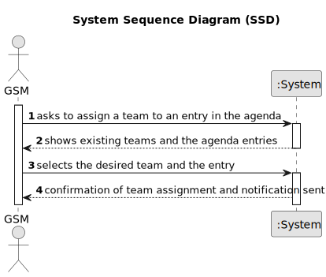

# US23 - Assign a team to an entry in the agenda

## 1. Requirements Engineering

### 1.1. User Story Description

As a GSM, I want to assign a Team to an entry in the Agenda

### 1.2. Customer Specifications and Clarifications 

**From the specifications document:**

> The Agenda is made up of entries that relate to a task (which was previously in the To-Do List) and 
the team that will carry out the tasks.

**From the client clarifications:**

> **Question:** What is needed for a vehicle to be considered as needing a check-up?
>
> **Answer:** A vehicle appears on the list if its current kms exceed or there is a difference of less than 5% of the check-up frequency between the kms the vehicle had in the last check-up plus the check-up frequency.

> **Question:** What data should be displayed for each vehicle in the list?
>
> **Answer:** The list must clearly identify the vehicles through: plate number, brand, model and the reason that justified the checkup need.

> **Question:** Should the team be generated like in the us05 or should each element be selected manually
> **Answer:** There is only one US that allows to create teams, as you mentioned, the US05.

### 1.3. Acceptance Criteria

* **AC1:** A message must be sent to all team members informing
  them about the assignment.

* **AC2:** Different email services can send the message. These services must be defined through a configuration file to allow the use
  of different platforms (e.g. Gmail, DEI’s email service, etc.).

### 1.4. Found out Dependencies

* There is a dependency on "US007 - Generate a Team Proposal" as there must be at least one team to assign an entry.
* There is also a dependency on "US22 - Add entry to the agenda" because in order to assign teams to an entry, there must be existing entries.

### 1.5 Input and Output Data

**Input Data:**

* Selected data:

  * Agenda Entry
  * Team

**Output Data:**

* (In)success message of team assignment
### 1.6. System Sequence Diagram (SSD)

### 1.7 Other Relevant Remarks

