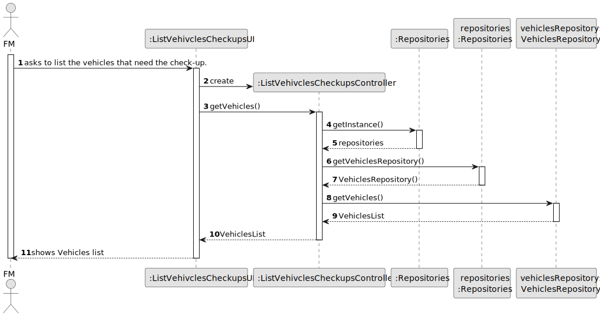
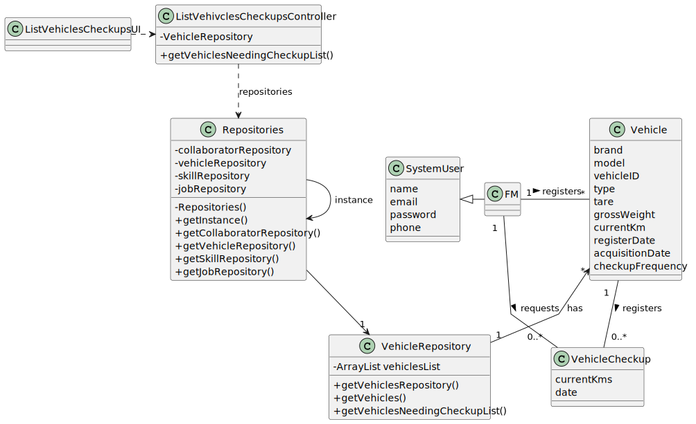

# US23 - Assign a team to an entry in the agenda

## 3. Design - User Story Realization 

### 3.1. Rationale

_**Note that SSD - Alternative One is adopted.**_

| Interaction ID                                             | Question: Which class is responsible for...                                                                                   | Answer                                    | Justification (with patterns)                                                                                 |
|:-----------------------------------------------------------|:------------------------------------------------------------------------------------------------------------------------------|:------------------------------------------|:--------------------------------------------------------------------------------------------------------------|
| Step 1 (asks to list the vehicles needing a check\-up)  		 | 	... interacting with the actor?                                                                                              | ListVehivclesCheckupsUI                   | Pure Fabrication: there is no reason to assign this responsibility to any existing class in the Domain Model. |
| 			  		                                                    | 	... coordinating the US?                                                                                                     | ListVehivclesCheckupsController           | Controller                                                                                                    |
| 			  		                                                    | ...getting the vehicles list?                                                                                                 | VehiclesRepository                        | IE: has the data                                                                                              |
| 			  		                                                    | ...displaying the list and form for input data?	                                                                              | ListVehivclesCheckupsUI                   | Pure Fabrication                                                                                              |
| Step 2 (displays the vehicles that need a check-up)			  		 | ...displaying the form for input data?	      							                                                                          | ListVehivclesCheckupsUI                               | Pure Fabrication                                                                                              |

According to the taken rationale, the conceptual classes promoted to software classes are: 

* Vehicle

Other software classes (i.e. Pure Fabrication) identified: 

*  ListVehivclesCheckupsUI
*  ListVehivclesCheckupsController
*  VehiclesRepodsitory

## 3.2. Sequence Diagram (SD)
### Full Diagram

This diagram shows the full sequence of interactions between the classes involved in the realization of this user story.

## 3.3. Class Diagram (CD)

