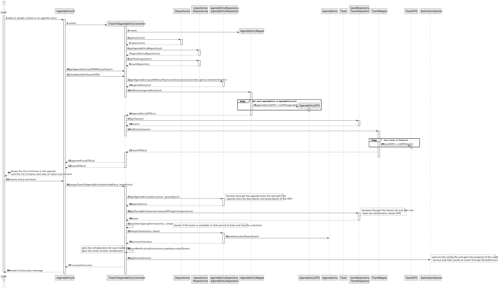

# US23 - Assign a team to an entry in the agenda

## 3. Design - User Story Realization 

### 3.1. Rationale

_**Note that SSD - Alternative One is adopted.**_

| Interaction ID                                    | Question: Which class is responsible for...     | Answer                        | Justification (with patterns)                                                                                                                                                                 |
|:--------------------------------------------------|:------------------------------------------------|:------------------------------|:----------------------------------------------------------------------------------------------------------------------------------------------------------------------------------------------|
| Step 1 (asks to assign a team to an Agenda Entry) | 	... interacting with the actor?	               | TeamToAgendaEntryUI           | 	Pure Fabrication: there is no reason to assign this responsibility to any existing class in the Domain Model.                                                                                |
|                                                   | ... coordinating the US?	                       | TeamToAgendaEntryController	  | Controller: Deals with how to delegate the request from the UI layer.                                                                                                                         |
| Step 2 (creat the controller)                     | 	... creating the controller?                   | 	TeamToAgendaEntryUI          | 	Creator:  A class should be responsible for creating objects of other classes if the first class aggregates, contains, or has a composition relationship with the second class               |
| Step 3 (get the list of agenda entries)           | 	... getting the agenda entry DTO list?         | 	TeamToAgendaEntryController	 | Controller: Responsible for fetching and transforming data to be displayed.                                                                                                                   |
|                                                   | 	... retrieving the agenda entries?             | 	AgendaEntryRepository        | 	IE: Has access to the data needed to fulfill the request.                                                                                                                                    |
|                                                   | 	... transforming agenda entries to DTOs?	      | AgendaEntryMapper             | 	Pure Fabrication: A utility class to handle the transformation.       Data Transfer Object(DTO): reduce the number of transactions that are being made all around the application    |
| Step 4 (get the list of teams)                    | ... getting the agenda entry DTO list?          | TeamToAgendaEntryController	  | Controller: Responsible for fetching and transforming data to be displayed.                                                                                                                   |
|                                                   | 	... retrieving the list of teams?              | 	TeamRepository	              | IE: Has access to the data needed to fulfill the request.                                                                                                                                     |
|                                                   | 	... transforming teams to DTOs?                | TeamMapper                    | 	Pure Fabrication: A utility class to handle the transformation.          Data Transfer Object(DTO): reduce the number of transactions that are being made all around the application |
| Step 5 (display the list of entries and teams)    | 	... displaying the list of entries and teams?	 | TeamToAgendaEntryUI           | 	Pure Fabrication: Responsible for interacting with the user.                                                                                                                                 |
| Step 6 (selects an entry and a team)	             | ... capturing the selected entry and team?      | 	TeamToAgendaEntryUI          | 	Pure Fabrication: UI component responsible for user input.                                                                                                                                   |
|                                                   | ...storing the data temporarily?	               | TeamToAgendaEntryUI	          | IE: has the data                                                                                                                                                                              |
| Step 7(confirm)                                   | ...cretaing AgendaEntryDTO                      | TeamToAgendaEntryUI		         | IE: has the data    Data Transfer Object(DTO): reduce the number of transactions that are being made all around the application                                                       |
| Step 8 (assigning the team to the agenda entry)   | 	... assigning the team to the agenda entry?	   | TeamToAgendaEntryController   | 	Controller: Coordinates the assignment process.                                                                                                                                              |                                                 |                               |                                                                                                                                                                                               |
| Step 9 (get the specific agenda entry)	           | ... retrieving the specific agenda entry?       | 	AgendaEntryRepository        | 	IE: Has access to the specific agenda entry.                                                                                                                                                 |
| Step 10 (update the agenda entry)                 | ... updating the agenda entry with the team?    | 	AgendaEntryRepository        | 	IE: Responsible for updating the entry in the repository.                                                                                                                                    |
| Step 11 (sending notification emails)             | 	... sending notification emails?               | 	TeamToAgendaEntryController  | 	Controller: Coordinates the email notification process.                                                                                                                                      |
|                                                   | ... creating the email service?                 | 	ApplicationSession           | 	Creator: Responsible for creating and managing the email service.        Adapter : Convert the interface of a class into another interface that clients expect                       |
| Step 12(displays message of (in)success)          | 	... displaying the success or failure message? | 	AgendaEntryUI                | 	Pure Fabrication.                                                                                                                                                                            |

According to the taken rationale, the conceptual classes promoted to software classes are: 

*  TeamToAgendaEntryUI
*  TeamToAgendaEntryController
*  AgendaRepository
* AgendaEntryMapper
* AgendaEntryDTO
* TeamRepository
* TeamDTO
* TeamMapper
* Application Service

## 3.2. Sequence Diagram (SD)
### Full Diagram

This diagram shows the full sequence of interactions between the classes involved in the realization of this user story.

## 3.3. Class Diagram (CD)

