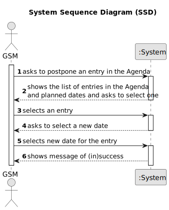

# US008 - Postpone an agenda entry

## 1. Requirements Engineering

### 1.1. User Story Description

As a GSM, I want to postpone an entry on the agenda. 

### 1.2. Customer Specifications and Clarifications 

**From the specifications document:**

>The new date accepted needs to be after the current date (postpone).

**From the client clarifications:**

> **Question:** The date you want to postpone in this US24 is the date referring to the "approximate expected duration" field when we registered the task?
>
> **Answer:** No. Sometimes, for various reasons (e.g. insufficient staff, faulty equipment or adverse weather conditions) a task has to be postponed to a new date; task duration is not directly related to this.

### 1.3. Acceptance Criteria

* The date has to be a valid day of a month
* The new date needs to be after the previous one

### 1.4. Found out Dependencies

* There is a dependency on "US022 - Add entry to the Agenda" as there must be at least one entry in the agenda to change it's date.

### 1.5 Input and Output Data

**Input Data:**

* Selected data
  * entry from agenda
  * new date

**Output Data:**

* Message of (in)succcess.

### 1.6. System Sequence Diagram (SSD)

### 1.7 Other Relevant Remarks

* None