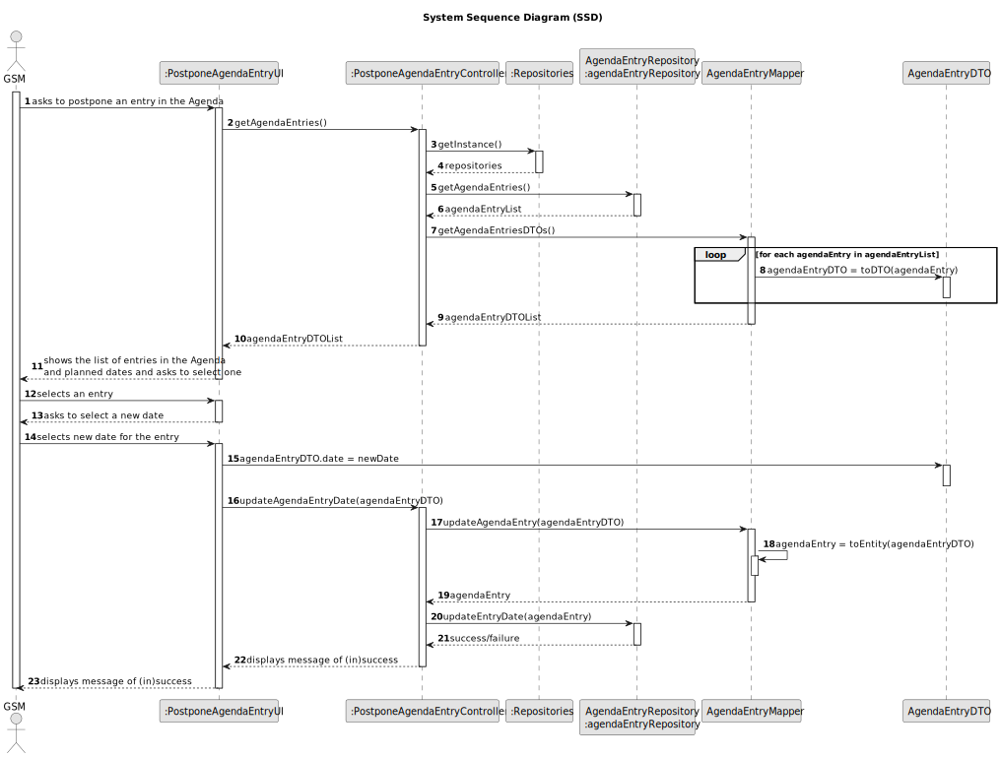
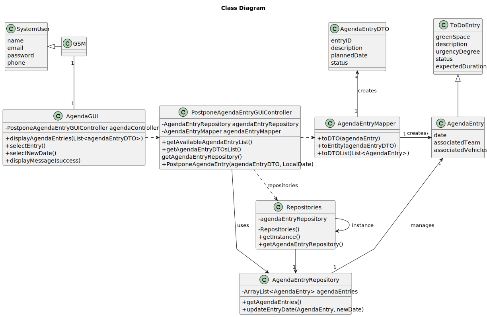

# US008 - List the vehicles needing the check-up

## 3. Design - User Story Realization 

### 3.1. Rationale

_**Note that SSD - Alternative One is adopted.**_

| Interaction ID                                                                                                     | Question: Which class is responsible for...                | Answer                          | Justification (with patterns)                                                                                            |
|:-------------------------------------------------------------------------------------------------------------------|:-----------------------------------------------------------|:--------------------------------|:-------------------------------------------------------------------------------------------------------------------------|
| Step 1 (asks to postpone an entry in the Agenda)                                                                  | ...interacting with the actor?                             | :AgendaUI                       | Pure Fabrication: there is no reason to assign this responsibility to any existing class in the Domain Model.            |
|                                                                                                                    | ...coordinating the use case?                              | :AgendaController               | Controller                                                                                                               |
| Step 2 (getAgendaEntries)                                                                                          | ...retrieving the agenda entries?                          | AgendaEntryRepository           | IE: has the data                                                                                                         |
|                                                                                                                    | ...managing repository instances?                          | RepositorySingleton             | IE: ensures a single instance of repositories                                                                            |
| Step 3 (getAgendaEntriesDTOs)                                                                                      | ...transforming entities to DTOs?                          | AgendaEntryMapper               | Pure Fabrication: handles transformation logic                                                                            |
|                                                                                                                    | ...storing the list of DTOs?                               | List<AgendaEntryDTO>            | Pure Fabrication: simple data structure to hold DTOs                                                                     |
| Step 4 (shows the list of entries and planned dates, asks to select one)                                           | ...displaying the agenda entries?                          | :AgendaUI                       | Pure Fabrication                                                                                                         |
| Step 5 (selects an entry)                                                                                          | ...interacting with the actor to select an entry?          | :AgendaUI                       | Pure Fabrication: handles UI interaction                                                                                 |
| Step 6 (asks to select a new date)                                                                                 | ...interacting with the actor to select a new date?        | :AgendaUI                       | Pure Fabrication                                                                                                         |
| Step 7 (selects a new date)                                                                                        | ...interacting with the actor to get the new date?         | :AgendaUI                       | Pure Fabrication                                                                                                         |
| Step 8 (updateAgendaEntryDate)                                                                                     | ...coordinating the update of the entry date?              | :AgendaController               | Controller                                                                                                               |
| Step 9 (updateAgendaEntry)                                                                                        | ...transforming DTO to entity with the new date?           | AgendaEntryMapper               | Pure Fabrication: handles transformation logic                                                                            |
| Step 10 (updateEntryDate)                                                                                         | ...updating the entry date in the repository?              | AgendaEntryRepository           | IE: has the data                                                                                                         |
| Step 11 (displays message of (in)success)                                                                         | ...displaying the result of the operation?                 | :AgendaUI                       | Pure Fabrication                                                                                                         |

According to the taken rationale, the conceptual classes promoted to software classes are: 

* None, all classes are already used in US022

Other software classes (i.e. Pure Fabrication) identified: 

*  PostponeAgendaEntryUI
*  PostponeAgendaEntryController

## 3.2. Sequence Diagram (SD)
### Full Diagram

This diagram shows the full sequence of interactions between the classes involved in the realization of this user story.

## 3.3. Class Diagram (CD)

