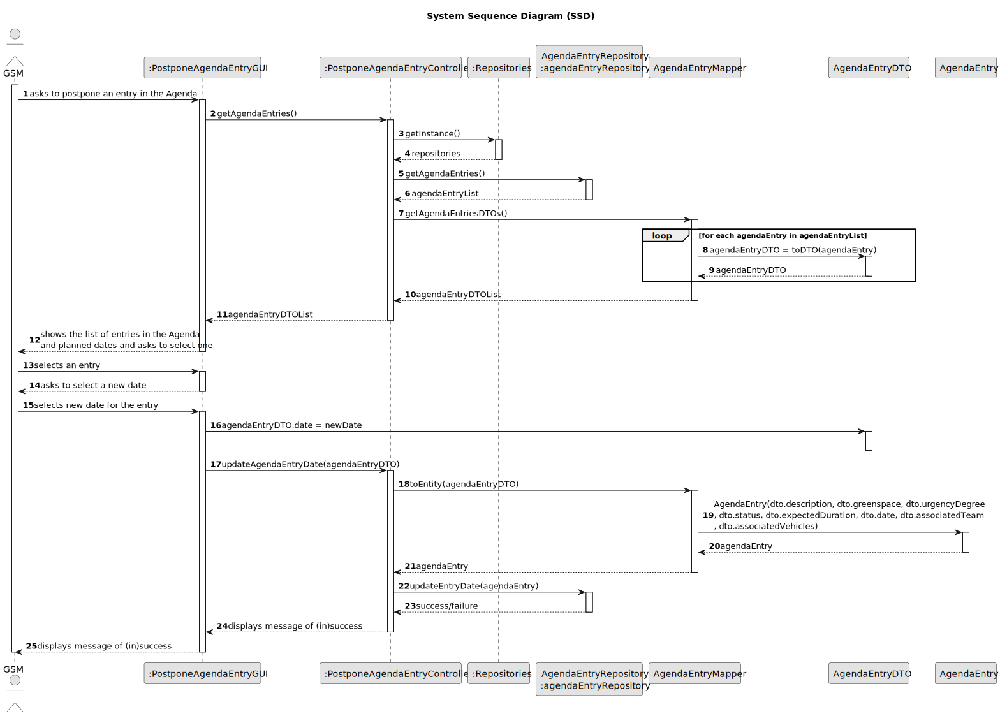

    # US024 - POSTPONE AN AGENDA ENTRY

## 3. Design - User Story Realization 

### 3.1. Rationale

_**Note that SSD - Alternative One is adopted.**_

| Interaction ID                                                                                                     | Question: Which class is responsible for...                | Answer                          | Justification (with patterns)                                                                                            |
|:-------------------------------------------------------------------------------------------------------------------|:-----------------------------------------------------------|:--------------------------------|:-------------------------------------------------------------------------------------------------------------------------|
| Step 1 (asks to postpone an entry from the Agenda)                                                                 | ...interacting with the actor?                             | PostponeAgendaEntryUI           | Pure Fabrication: there is no reason to assign this responsibility to any existing class in the Domain Model.            |
|                                                                                                                    | ...coordinating the use case?                              | PostponeAgendaEntryController   | Controller                                                                                                               |
| Step 2 (displays the Agenda entries)                                                                               | ...displaying the available Agenda entries?                | PostponeAgendaEntryUI           | Pure Fabrication                                                                                                         |
|                                                                                                                    | ...retrieving the available Agenda entries?                | AgendaEntryRepository           | Information Expert: has the data                                                                                          |
|                                                                                                                    | ...managing repository instances?                          | RepositorySingleton             | Information Expert: ensures a single instance of repositories                                                             |
|                                                                                                                    | ...storing the list of DTOs?                               | List<AgendaEntryDTO>            | Pure Fabrication: simple data structure to hold DTOs                                                                     |
| Step 3 (selects the desired entry to postpone)                                                                     | ...interacting with the actor to select an entry?          | PostponeAgendaEntryUI           | Pure Fabrication: handles UI interaction                                                                                 |
| Step 4 (asks for a new date for the entry on the Agenda)                                                           | ...interacting with the actor to select a new date?        | PostponeAgendaEntryUI           | Pure Fabrication                                                                                                         |
| Step 5 (selects new date for the entry)                                                                            | ...interacting with the actor to get the new date?         | PostponeAgendaEntryUI           | Pure Fabrication                                                                                                         |
|                                                                                                                    | ...updating the Agenda entry DTO with the new date?        | AgendaEntryDTO                  | Information Expert: responsible for its own data                                                                         |
| Step 6 (displays message of (in)success)                                                                           | ...displaying the result of the operation?                 | PostponeAgendaEntryUI           | Pure Fabrication                                                                                                         |
|                                                                                                                    | ...coordinating the update of the entry in the Agenda?     | PostponeAgendaEntryController   | Controller                                                                                                               |
|                                                                                                                    | ...updating the entry in the Agenda repository?            | AgendaEntryRepository           | Information Expert: has the data                                                                                          |
According to the taken rationale, the conceptual classes promoted to software classes are: 

* None, all classes are already used in US022

Other software classes (i.e. Pure Fabrication) identified: 

*  PostponeAgendaEntryUI
*  PostponeAgendaEntryController

## 3.2. Sequence Diagram (SD)
### Full Diagram

This diagram shows the full sequence of interactions between the classes involved in the realization of this user story.

**Get Agenda Entries**

**Select Entry and new Date**

**Update Agenda Entry Date**

## 3.3. Class Diagram (CD)

