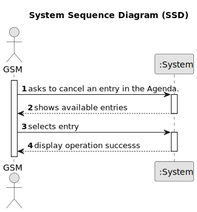

# US025 - Cancel an entry in the Agenda.

## 1. Requirements Engineering

### 1.1. User Story Description
As a GSM, I want to Cancel an entry in the Agenda.

### 1.2. Customer Specifications and Clarifications 

**From the specifications document:**

> The Agenda is made up of entries that relate to a task with a status (Planned, Postponed, Canceled,
Done).

**From the client clarifications:**

> **Question:** What is needed for a vehicle to be considered as needing a check-up?
>
> **Answer:** A vehicle appears on the list if its current kms exceed or there is a difference of less than 5% of the check-up frequency between the kms the vehicle had in the last check-up plus the check-up frequency.

> **Question:** What data should be displayed for each vehicle in the list?
>
> **Answer:** The list must clearly identify the vehicles through: plate number, brand, model and the reason that justified the checkup need.

### 1.3. Acceptance Criteria

* **AC1:**  A canceled task should not be deleted but rather change its
state.

### 1.4. Found out Dependencies

* There is a dependency on "US006 - Register a vehicle" as there must be at least one vehicle to list.

### 1.5 Input and Output Data

**Input Data:**

* Selected data
    * Entry

**Output Data:**

* (In)success of the operation 

### 1.6. System Sequence Diagram (SSD)

### 1.7 Other Relevant Remarks
