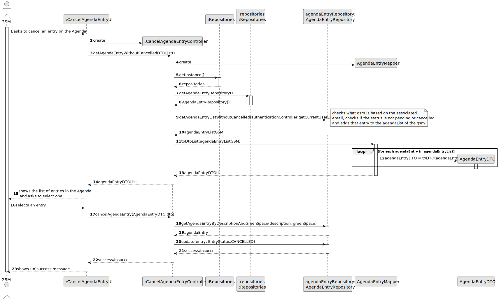

#  US025 - Cancel an entry in the Agenda.
## 3. Design - User Story Realization 

### 3.1. Rationale

| Interaction ID                                    | Question: Which class is responsible for...      | Answer                       | Justification (with patterns)                                                                                                                                                                      |
|:--------------------------------------------------|:-------------------------------------------------|:-----------------------------|:---------------------------------------------------------------------------------------------------------------------------------------------------------------------------------------------------|
| Step 1 (asks to cancel an Agenda Entry)  		       | 	... interacting with the actor?                 | CancelAgendaEntryUI          | Pure Fabrication: there is no reason to assign this responsibility to any existing class in the Domain Model.                                                                                      |
| 			  		                                           | 	... coordinating the US?                        | CancelAgendaEntryController  | Controller:  Deals with how to delegate the request from the UI layer                                                                                                                              |
| Step 2 (creating the controller)                  | 	... creating the controller?	                   | CancelAgendaEntryUI	         | Creator: a class should be responsible for creating objects of other classes if the first class aggregates, contains, or has a composition relationship with the second class                      |                                                      |                             |                                                                                                               |
| Step 3 (get the list of agenda entries)	          | ... getting the agenda entry DTO list?	          | CancelAgendaEntryController	 | Controller: Responsible for fetching and transforming data to be displayed.    Data Transfer Object(DTO): reduce the number of transactions that are being made all around the application |
| 			  		                                           | ... retrieving the agenda entries?               | 	AgendaEntryRepository	      | IE: Has access to the data needed to fulfill the request.                                                                                                                                          |
|                                                   | ...transforming agenda entries to DTOs?	         | AgendaEntryMapper            | 	Pure Fabrication: A utility class to handle the transformation.       Data Transfer Object(DTO): reduce the number of transactions that are being made all around the application         |
| Step 6 (display agenda entries)                   | 	... displaying the list of agenda entries DTO?	 | CancelAgendaEntryUI	         | Pure Fabrication: Responsible for interacting with the user.                                                                                                                                       |
| Step 7 (selects the entry)                        | 	...displaying confirmation button?	             | RegisterToDoEntryUI          | 	Pure Fabrication       Data Transfer Object(DTO): reduce the number of transactions that are being made all around the application                                                        |
|                                                   | ...storing the data temporarily?	                | RegisterToDoEntryUI	         | IE: has the data                                                                                                                                                                                   |
| Step 8(confirm)                                   | ...cretaing AgendaEntryDTO                       | CancelAgendaEntryUI	         | IE: has the data    Data Transfer Object(DTO): reduce the number of transactions that are being made all around the application                                                            |
| Step 8 (cancel agenda entry)	                     | ... cancelling the agenda entry?	                | CancelAgendaEntryController  | 	Controller: Coordinates the cancellation process.                                                                                                                                                 |                                                  |                              |                                                                                                                                                                               |
| Step 9 (get the specific agenda entry to cancel)	 | ... retrieving the specific agenda entry?        | AgendaEntryRepository	       | IE: Has access to the specific agenda entry.                                                                                                                                                       |
| Step 10 (update the status	                       | ... updating the status of the agenda entry?     | 	AgendaEntryRepository	      | IE: Responsible for updating the entry status in the repository.                                                                                                                                   |
| Step 11 (displays message of (in)success)         | 	... displaying the success or failure message?  | 	CancelAgendaEntryUI         | 	Pure Fabrication: Responsible for user feedback.                                                                                                                                                  |

According to the taken rationale, the conceptual classes promoted to software classes are:

*  CancelAgendaEntryUI
*  CancelAgendaEntryController
*  AgendaRepository
* AgendaEntryMapper
* AgendaEntryDTO

## 3.2. Sequence Diagram (SD)
### Full Diagram

This diagram shows the full sequence of interactions between the classes involved in the realization of this user story.

## 3.3. Class Diagram (CD)

