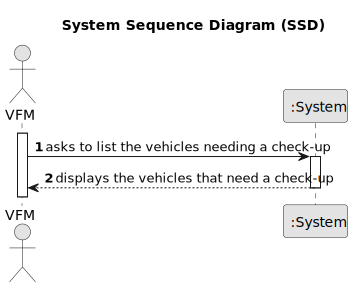

# US008 - List the vehicles needing the check-up

## 1. Requirements Engineering

### 1.1. User Story Description

As a FM, I want to list the vehicles needing the check-up. 

### 1.2. Customer Specifications and Clarifications 

**From the specifications document:**

> The list must clearly identify the vehicles through: plate number, brand, model, current kms, checkup frequency, kms at last checkup, and the kms the vehicle must have at the next checkup.

**From the client clarifications:**

> **Question:**
Should all company vehicles be available to assign them to a calendar entry, or only vehicles with up-to-date maintenance?
>
> **Answer:** All vehicles that are not assigned to a task in the same period.
In a real context we also need to manage (un)availability of vehicles due to overhauls or breakdowns but it is not necessary in this proof of concept

> **Question:**
What are the criteries to accept a assign of a Vehicle to a Entry?
Only Vehicle with no Entry's can be assigned ?
Only Vehicles with no Entry on the day selected ?
It is possible to add any kind of vehicles?
what are the maximum number of vehicles that can be added to a entry?
>
> **Answer:** The vehicle needs to be available in the period.
Yes, any can of vehicles can be assigned.

### 1.3. Acceptance Criteria

* A vehicle must fulfill the criteria to need a checkup in order to appear on the list.

### 1.4. Found out Dependencies

* There is a dependency on "US006 - Register a vehicle" as there must be at least one vehicle to list.

### 1.5 Input and Output Data

**Input Data:**

* n\a

**Output Data:**

* List of vehicles that need the check-up.

### 1.6. System Sequence Diagram (SSD)

### 1.7 Other Relevant Remarks

* If a check-up has never been registered for a vehicle its kms at last check-up are 0. 