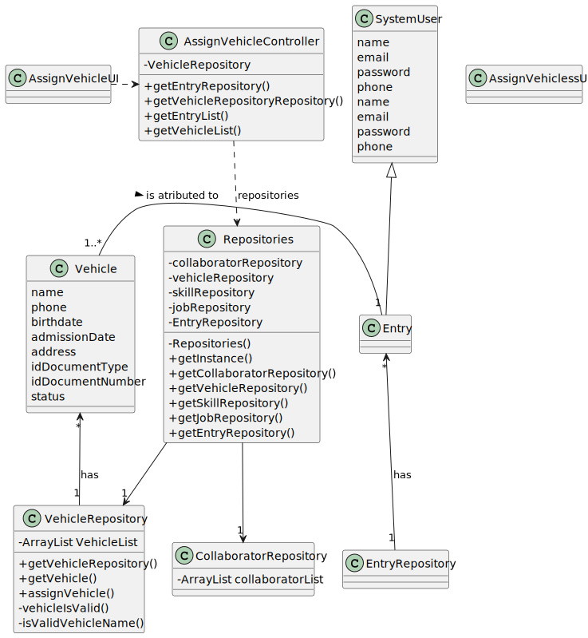

# US008 - List the vehicles needing the check-up

## 3. Design - User Story Realization 

### 3.1. Rationale

_**Note that SSD - Alternative One is adopted.**_

| Interaction ID                                                 | Question: Which class is responsible for...          | Answer                   | Justification (with patterns)                                                                                 |
|:---------------------------------------------------------------|:-----------------------------------------------------|:-------------------------|:--------------------------------------------------------------------------------------------------------------|
| Step 1 (asks to add vehicles to an entry in the agenda)  		    | 	... interacting with the actor?                     | AssignVehiclesUI         | Pure Fabrication: there is no reason to assign this responsibility to any existing class in the Domain Model. |
| 			  		                                                        | ... coordinating the US?                             | AssignVehiclesController | Controller                                                                                                    |
| Step 2 (shows list of entries and the list of vehicles)			  		 | ...getting the entries list?    							              | VehiclesRepository       | IE: has the data                                                                                              |
| 			  		                                                        |  ...displaying the list and form for input data?		                     | AssignVehicleUI          | pure fabrication                                                                                              |
| 		  		                                                         | ...getting the vehicles list?                        | EntryRepository          | IE: has the data                                                                                              |
| 			  		                                                        | ...displaying the form for input data?	      							 | AssignVehicleUI          | Pure Fabrication                                                                                              |
|Step 3 (chooses an entry) | ...storing the selected data temporarily?  	| AssignVehicleUI | Pure fabrication|	
|Step 4 (chooses vehicles from list to add) | ...storing the selected data temporarily? | AssignVehicleUI | Pure fabrication|
|Step 5 (Show list of entry's current vehicles) | ...displaying the form for input data?|  AssignSkillsUI  | Pure fabrication|

According to the taken rationale, the conceptual classes promoted to software classes are:

* Vehicles
* Entries

Other software classes (i.e. Pure Fabrication) identified: 

*  AssignVehicleUI
*  AssignVehicleController
*  VehiclesRepository
*  EntryRepository

## 3.2. Sequence Diagram (SD)
### Full Diagram

This diagram shows the full sequence of interactions between the classes involved in the realization of this user story.

## 3.3. Class Diagram (CD)

