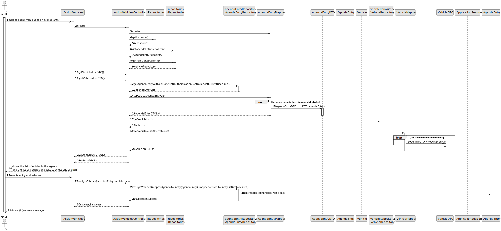
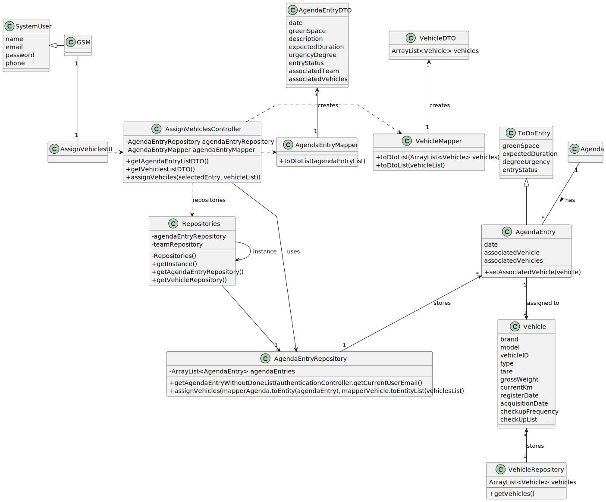

# US026 - Assign Vehicles to a Agenda entry

## 3. Design - User Story Realization 

### 3.1. Rationale

_**Note that SSD - Alternative One is adopted.**_

| Interaction ID                                    | Question: Which class is responsible for...     | Answer                        | Justification (with patterns)                                                                                                                                                                 |
|:--------------------------------------------------|:------------------------------------------------|:------------------------------|:----------------------------------------------------------------------------------------------------------------------------------------------------------------------------------------------|
| Step 1 (asks to assign vehicles to an Agenda Entry) | ... interacting with the actor?                  | AgendaEntryUI                 | Pure Fabrication: there is no reason to assign this responsibility to any existing class in the Domain Model.                                                                                  |
|                                                   | ... coordinating the US?                         | AssignVehiclesController      | Controller: Deals with how to delegate the request from the UI layer.                                                                                                                         |
| Step 2 (create the controller)                    | ... creating the controller?                     | AgendaEntryUI                 | Creator: A class should be responsible for creating objects of other classes if the first class aggregates, contains, or has a composition relationship with the second class.                |
| Step 3 (get the list of agenda entries)           | ... getting the agenda entry DTO list?           | AssignVehiclesController      | Controller: Responsible for fetching and transforming data to be displayed.                                                                                                                   |
|                                                   | ... retrieving the agenda entries?               | AgendaEntryRepository         | IE: Has access to the data needed to fulfill the request.                                                                                                                                     |
|                                                   | ... transforming agenda entries to DTOs?         | AgendaEntryMapper             | Pure Fabrication: A utility class to handle the transformation.       Data Transfer Object (DTO): reduce the number of transactions that are being made all around the application    |
| Step 4 (get the list of vehicles)                 | ... getting the vehicle DTO list?                | AssignVehiclesController      | Controller: Responsible for fetching and transforming data to be displayed.                                                                                                                   |
|                                                   | ... retrieving the list of vehicles?             | VehicleRepository             | IE: Has access to the data needed to fulfill the request.                                                                                                                                     |
|                                                   | ... transforming vehicles to DTOs?               | VehicleMapper                 | Pure Fabrication: A utility class to handle the transformation.          Data Transfer Object (DTO): reduce the number of transactions that are being made all around the application |
| Step 5 (display the list of entries and vehicles) | ... displaying the list of entries and vehicles? | AgendaEntryUI                 | Pure Fabrication: Responsible for interacting with the user.                                                                                                                                  |
| Step 6 (selects an entry and vehicles)            | ... capturing the selected entry and vehicles?   | AgendaEntryUI                 | Pure Fabrication: UI component responsible for user input.                                                                                                                                    |
|                                                   | ... storing the data temporarily?                | AgendaEntryUI                 | IE: has the data                                                                                                                                                                              |
| Step 7 (assign vehicles to the agenda entry)      | ... assigning the vehicles to the agenda entry?  | AssignVehiclesController      | Controller: Coordinates the assignment process.                                                                                                                                               |
| Step 8 (get the specific agenda entry)            | ... retrieving the specific agenda entry?        | AgendaEntryRepository         | IE: Has access to the specific agenda entry.                                                                                                                                                  |
|                                                   | ... retrieving the selected vehicles?            | VehicleRepository             | IE: Has access to the specific vehicles.                                                                                                                                                      |
| Step 9 (update the agenda entry)                  | ... updating the agenda entry with the vehicles? | AgendaEntry                   | IE: Responsible for updating the entry in the repository.                                                                                                                                     |
| Step 10 (sending notification of success/insuccess) | ... sending notification of success/insuccess?  | AssignVehiclesController      | Controller: Coordinates the notification process.                                                                                                                                             |
| Step 11 (displays message of success/insuccess)   | ... displaying the success or failure message?   | AgendaEntryUI                 | Pure Fabrication.                                                                                                                                                                             |

According to the taken rationale, the conceptual classes promoted to software classes are:

*  Vehicles
*  Entries
*  AssignVehicleUI
*  AssignVehicleController
*  VehiclesRepository
*  EntryRepository

## 3.2. Sequence Diagram (SD)
### Full Diagram

This diagram shows the full sequence of interactions between the classes involved in the realization of this user story.

### Partial Diagrams

1.  Initial Request and Controller Setup

2. Show entries and teams

3. Assign team

## 3.3. Class Diagram (CD)

