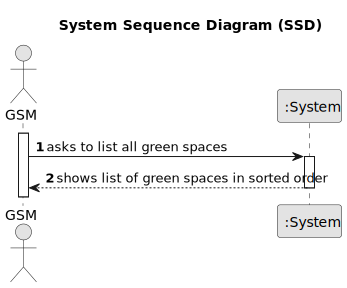

# US027 - List all green spaces managed by a GSM

## 1. Requirements Engineering

### 1.1. User Story Description

As a GSM, I need to list all green spaces managed by me.

### 1.2. Customer Specifications and Clarifications 

**From the specifications document:**

>  The GSM is the person responsible for managing
the green spaces in charge of the organization.

**From the client clarifications:**

> **Question:** which info about Green Spaces do you want the GSM see when listing? only the name ?
>
> **Answer:** Each de team can decide about the aspects related to UX/UI.

> **Question:** What data should be displayed for each vehicle in the list?
>
> **Answer:** The list must clearly identify the vehicles through: plate number, brand, model and the reason that justified the checkup need.

### 1.3. Acceptance Criteria

* **AC1:** The list of green spaces must be sorted by size in descending order. The sorting algorithm to be used by the application
  must be defined through a configuration file. At least two sorting
  algorithms should be available.

### 1.4. Found out Dependencies

* There is a dependency on "US020 - Register a Green Space" as it can only be possible to list green spaces if they have been already registered.

### 1.5 Input and Output Data

**Input Data:**

**Output Data:**

* List of green spaces in sorted order
### 1.6. System Sequence Diagram (SSD)

### 1.7 Other Relevant Remarks
none