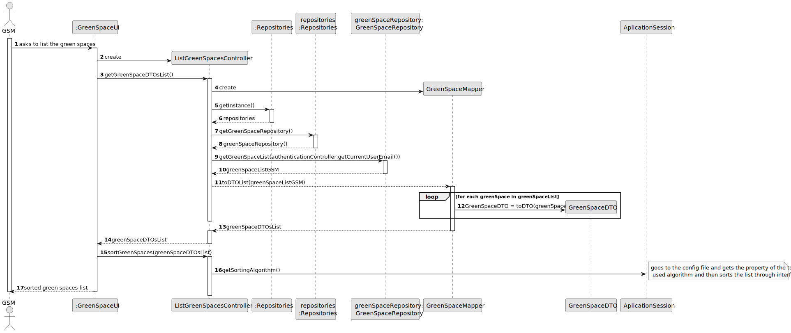
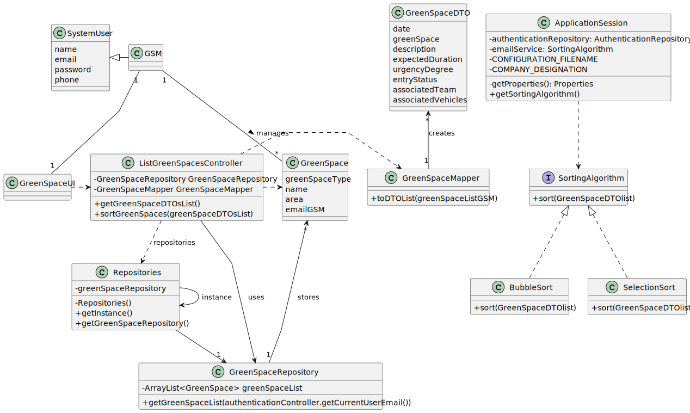

# US027 - List all green spaces managed by a GSM

## 3. Design - User Story Realization 

### 3.1. Rationale

_**Note that SSD - Alternative One is adopted.**_

| Interaction ID                          | Question: Which class is responsible for...   | Answer                    | Justification (with patterns)                                                                                                               |
|:----------------------------------------|:----------------------------------------------|:--------------------------|:--------------------------------------------------------------------------------------------------------------------------------------------|
| Step 1 (asks to list the green spaces)	 | ... interacting with the actor?	              | GreenSpaceUI	             | Pure Fabrication: Responsible for user interaction.                                                                                         |
| 			  		                                 | 	... coordinating the US?                     | ListGreenSpacesController | 	Controller: Coordinates the user request to list green spaces.                                                                             |
| Step 2 (create the controller)	         | ... creating the controller?                  | 	GreenSpaceUI             | 	Creator: Responsible for creating the controller.                                                                                          |
| Step 3 (get the green spaces DTO list)  | 	... getting the green spaces DTO list?	      | ListGreenSpacesController | 	Controller: Fetches and transforms data to be displayed.                                                                                   | 			  		                                                    | ...displaying the list and form for input data?	     | ListVehivclesCheckupsUI                                                                  | Pure Fabrication                                                |
|                                         | ... retrieving the green spaces?              | 	GreenSpaceRepository	    | IE: Has access to the data needed to fulfill the request.                                                                                   |
|                                         | .. transforming green spaces to DTOs?         | 	GreenSpaceMapper	        | Pure Fabrication: A utility class to handle the transformation.                                                                             |
| Step 4 (display green spaces)           | 	... displaying the list of green spaces DTO? | 	GreenSpaceUI             | 	Pure Fabrication: Responsible for interacting with the user.                                                                               |
| Step 5 (sort green spaces)	             | ... sorting the green spaces?	                | ListGreenSpacesController | 	Controller: Coordinates sorting of the list.                                                                                               |
| Step 6 (get sorting algorithm)          | 	... getting the sorting algorithm?           | 	ApplicationSession	      | IE: Accesses the application configuration to retrieve the sorting algorithm.                                                               |
| Step 7 (return sorted list to user)	    | ... returning the sorted list to the user?    | 	GreenSpaceUI	            | Pure Fabrication: Responsible for interacting with the user.Step 7 (return sorted list to user)	... returning the sorted list to the user?	 | GreenSpaceUI	                                 |Pure Fabrication: Responsible for interacting with the user.

According to the taken rationale, the conceptual classes promoted to software classes are: 

*  GreenSpaceUI
*  ListGreenSpacesController
*  GreenSpaceRepository
* GreenSpaceMapper
* ApplicationSession

## 3.2. Sequence Diagram (SD)
### Full Diagram

This diagram shows the full sequence of interactions between the classes involved in the realization of this user story.

### Full Diagram

1. Request list of agenda Entries 

2. Retrieves list of agenda entries 

3. Sort the list of agenda entries

## 3.3. Class Diagram (CD)

