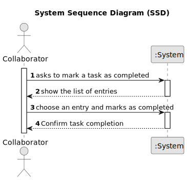

# US029 - Mark a task as completed

## 1. Requirements Engineering

### 1.1. User Story Description

As a Collaborator, I want to record the completion of a task

### 1.2. Customer Specifications and Clarifications 

**From the specifications document:**

> Tasks are carried out on an occasional or regular basis, in one or more green spaces, for example: tree pruning, installation of an irrigation system, and installation of a lighting system

**From the client clarifications:**

> **Question:**
Can an employee record more than one completed task at a time?
>
> **Answer:** It's a matter of UX/UI, each dev team can decide about it.

> **Question:**
When a collaborator records a task, it should be asked for any observations regarding the completed task?
>
> **Answer:** Maybe if optional, not mandatory.

>**Question**
As far as I understand, when a GSM wants to cancel a task or a Collaborator wants to record the completion of a task, the task just changes its status in the Agenda to "Canceled" or "Done", respectively.
So, my question is the following: does the task associated with the Agenda entry in which this happens remain in the To-do List or can it be removed, unlike what happens in the Agenda? Or even, would this process be different between a completed task and a canceled task?
>
> **Answer**
Yes.
I suppose when a task goes to the Agenda, it leaves the To-Do list but maybe a different flow could be considered.

>**Question**
"As a Collaborator, I want to record the completion of a task." is "record" refers to the act of only changing the status of the task, or do we want to save a list of the completed tasks within each Collaborator?
>
>**Answer** It means to record that a task was completed (changing the status) with the finish time.
### 1.3. Acceptance Criteria

* n/a

### 1.4. Found out Dependencies

* n/a

### 1.5 Input and Output Data

**Input Data:**

* Asks to mark a task as completed

**Output Data:**

* Confirm task completion

### 1.6. System Sequence Diagram (SSD)

### 1.7 Other Relevant Remarks

* n/a